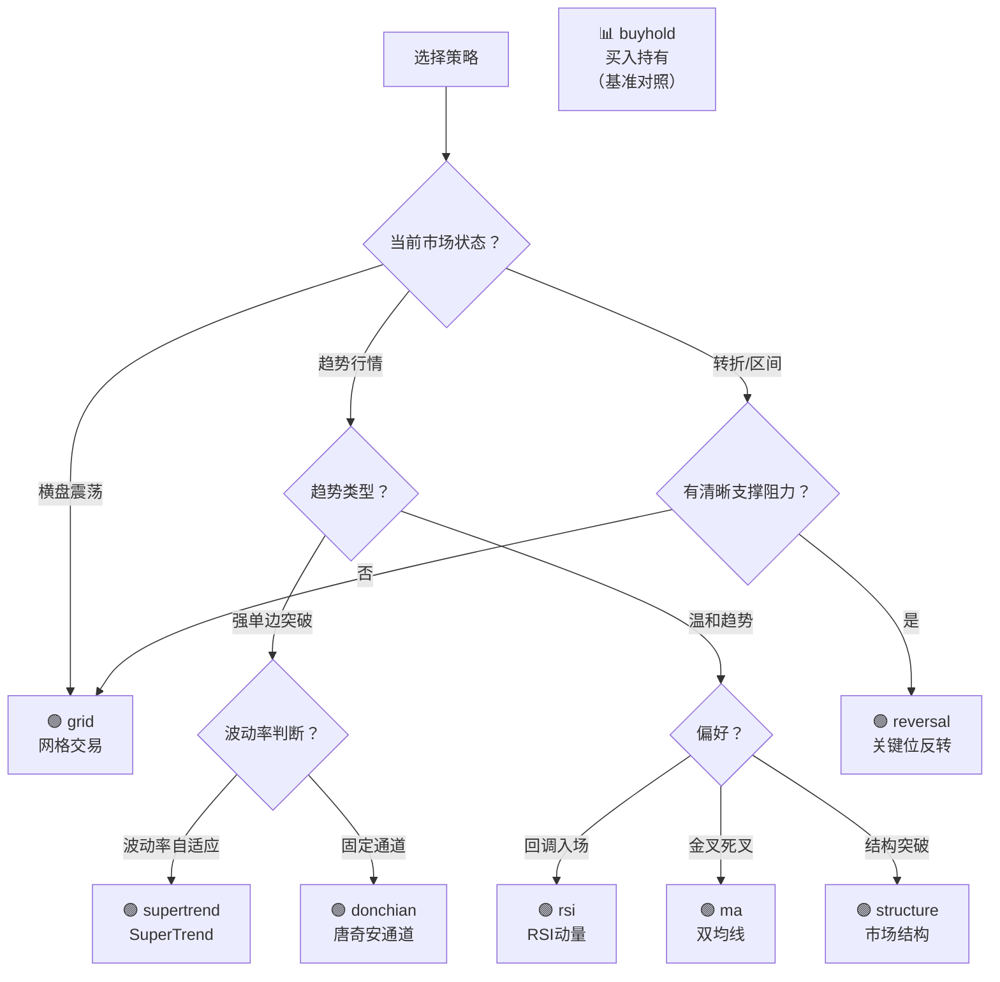

# 策略目录

**文档版本**：v1.0
**创建日期**：2026-06-20
**信息来源**：源码交叉验证 — `src/strategy/registry.py`、各策略文件（`src/strategy/*.py`）、`deliverables/qa-report-pre-launch.md`
**状态**：✅ 与源码一致

> 本文档中所有参数默认值、覆盖率和分类信息均直接从策略源文件的 `__init__` 签名、`PARAM_SCHEMA` 和 QA 报告中提取，未凭推测填写。

---

## 策略注册总览

（来自 `src/strategy/registry.py:45-54`）

| Registry Key | 类名 | 类型 | 继承 | 代码覆盖率 |
|--------------|------|------|------|-----------|
| `grid` | `GridTradingStrategy` | 震荡 | RiskAwareStrategy | 90% 🟢 |
| `rsi` | `RSIMomentumStrategy` | 趋势 | RiskAwareStrategy | 96% 🟢 |
| `ma` | `SimpleMAStrategy` | 趋势 | RiskAwareStrategy | 95% 🟢 |
| `buyhold` | `BuyAndHoldStrategy` | 基准 | RiskAwareStrategy | 100% 🟢 |
| `donchian` | `DonchianChannelStrategy` | 趋势 | RiskAwareStrategy | 95% 🟢 |
| `structure` | `MarketStructureStrategy` | 趋势 | RiskAwareStrategy | 98% 🟢 |
| `supertrend` | `SuperTrendStrategy` | 趋势 | RiskAwareStrategy | 86% 🟡 |
| `reversal` | `KeyLevelReversalStrategy` | 混合 | RiskAwareStrategy | 91% 🟢 |

**全部 8 个策略均继承 `RiskAwareStrategy`**，享有统一的熔断保护机制。

---

## 策略选择决策流程图

---

## 策略详解

---

### 1. 网格交易 — `grid`

**Registry key**：`"grid"`
**类**：`GridTradingStrategy`（`src/strategy/grid_trading.py`）
**类型**：🔄 震荡
**策略原理**：在预设价格区间内等距放置网格线，价格每下穿一条网格线买入一档，每上穿一条卖出对应档位。配合趋势/波动率过滤器和熔断条件，在不适合的市场环境主动暂停。适合横盘震荡、波动率适中、流动性好的市场。

**核心参数**：

| 参数 | 类型 | 默认值 | 安全范围 | 说明 |
|------|------|--------|----------|------|
| `lower_price` | float | — | > 0 | 价格下界（必填） |
| `upper_price` | float | — | > `lower_price` | 价格上界（必填） |
| `grid_count` | int | 10 | 5–30 | 网格数量 |
| `position_per_grid` | float | `1/grid_count` | 2%–15% | 每档占初始资金比例 |
| `enable_filters` | bool | True | — | 启用趋势/波动率过滤器 |
| `max_consecutive_losses` | int | 3 | ≥1 | 连亏熔断阈值 |
| `max_daily_loss` | float | 0.02 | 0–0.1 | 当日亏损熔断（占初始资金比例） |
| `initial_capital` | float | 10000 | — | 初始资金（熔断基准） |

**熔断支持**：✅ 继承 RiskAwareStrategy（连亏熔断 / 日亏损熔断 / 累计回撤熔断）+ 额外价格边界缓冲区（±5%）+ 数据异常暂停冷却（1小时）

**典型使用场景**：
- BTC/USDT 在 65000–68000 区间震荡
- 低波动率环境（如 ATR% < 3%）
- 作为组合中的"收割器"，在震荡中持续盈利

**不适用**：
- 单边强趋势（网格被击穿）
- 极端波动（频繁触发边界暂停）

**测试覆盖**：90% 🟢 — `test_grid_trading.py`，信号/熔断/出入场/边界全覆盖

---

### 2. RSI 动量 — `rsi`

**Registry key**：`"rsi"`
**类**：`RSIMomentumStrategy`（`src/strategy/rsi_momentum.py`）
**类型**：📈 趋势
**策略原理**：基于 RSI(14) 的超买超卖反转策略。当 RSI 低于超卖阈值（默认30）且价格在 EMA50 之上时买入；RSI 高于超买阈值（默认70）或价格跌破 EMA50 时卖出。可选 EMA 趋势方向过滤确认。RSI 和 EMA 均使用增量计算（O(1) per bar），避免全量重算。

**核心参数**：

| 参数 | 类型 | 默认值 | 安全范围 | 说明 |
|------|------|--------|----------|------|
| `rsi_period` | int | 14 | ≥2 | RSI 计算周期 |
| `oversold` | float | 30.0 | 0–100, < `overbought` | 超卖阈值 |
| `overbought` | float | 70.0 | 0–100, > `oversold` | 超买阈值 |
| `ema_period` | int | 50 | ≥1 | 趋势过滤 EMA 周期 |
| `enable_trend_filter` | bool | True | — | 启用 EMA 趋势确认 |
| `max_consecutive_losses` | int | 3 | ≥1 | 连亏熔断阈值 |
| `max_daily_loss` | float | 0.02 | 0–0.1 | 当日亏损熔断 |

**熔断支持**：✅ 继承 RiskAwareStrategy（连亏 / 日亏损 / 累计回撤）

**典型使用场景**：
- 趋势市场中的回调买入（RSI 超卖 + 价格在 EMA 上方）
- 与网格策略互补（网格管震荡，RSI 管趋势）

**不适用**：
- 强单边无回调行情（RSI 持续超买/超卖）

**测试覆盖**：96% 🟢 — `test_strategies_simple.py`，信号/熔断/出入场/边界全覆盖

---

### 3. 双均线 — `ma`

**Registry key**：`"ma"`
**类**：`SimpleMAStrategy`（`src/strategy/simple_ma.py`）
**类型**：📈 趋势
**策略原理**：经典金叉/死叉策略。短期均线上穿长期均线时买入（金叉）；短期均线下穿长期均线时卖出（死叉）。采用增量 MA 计算，不依赖全量 ewm() 重算。

**核心参数**：

| 参数 | 类型 | 默认值 | 安全范围 | 说明 |
|------|------|--------|----------|------|
| `short_window` | int | 5 | ≥1 | 短期均线窗口 |
| `long_window` | int | 10 | ≥1 | 长期均线窗口 |
| `max_consecutive_losses` | int | 5 | ≥1 | 连亏熔断阈值（更宽松，因双均线滞后大） |
| `max_daily_loss` | float | 0.02 | 0–0.1 | 当日亏损熔断 |

**熔断支持**：✅ 继承 RiskAwareStrategy（连亏 / 日亏损 / 累计回撤）

**典型使用场景**：
- 温和趋势市场（避免横盘中的频繁假信号）
- 作为组合的趋势方向基线

**不适用**：
- 剧烈震荡（频繁假信号）

**测试覆盖**：95% 🟢 — `test_strategies_simple.py`，信号/熔断/出入场/边界全覆盖

---

### 4. 买入持有 — `buyhold`

**Registry key**：`"buyhold"`
**类**：`BuyAndHoldStrategy`（`src/strategy/buy_and_hold.py`）
**类型**：📊 基准
**策略原理**：最简单的基准策略。在第一根 K 线买入，持有至回测结束。无参数、无信号逻辑。用于验证回测引擎正确性，并作为其他策略的收益率对照基准。

**核心参数**：

| 参数 | 类型 | 默认值 | 说明 |
|------|------|--------|------|
| （无参数） | — | — | 策略无 PARAM_SCHEMA，无用户可调参数 |

**熔断支持**：✅ 继承 RiskAwareStrategy（虽然实际不太触发）

**典型使用场景**：
- 回测引擎验证（"买入持有应该等于基准收益"）
- 策略收益对比（"我的策略是否跑赢买入持有？"）

**测试覆盖**：100% 🟢 — `test_strategies_simple.py`

---

### 5. 唐奇安通道 — `donchian`

**Registry key**：`"donchian"`
**类**：`DonchianChannelStrategy`（`src/strategy/donchian_channel.py`）
**类型**：📈 趋势
**策略原理**：Richard Donchian 经典趋势跟踪。价格突破 N 日最高价时买入，跌破 N 日最低价时卖出。使用前 period 根 bar 计算通道（避免当前 bar 的前视偏差）。在强趋势市场中表现优异。

**核心参数**：

| 参数 | 类型 | 默认值 | 安全范围 | 说明 |
|------|------|--------|----------|------|
| `period` | int | 20 | 5–100 | 通道计算周期 |
| `max_consecutive_losses` | int | 3 | ≥1 | 连亏熔断阈值 |
| `max_daily_loss` | float | 0.02 | 0–0.1 | 当日亏损熔断 |

**熔断支持**：✅ 继承 RiskAwareStrategy

**典型使用场景**：
- 强单边趋势市场
- 与网格策略互补（趋势 vs 震荡）

**不适用**：
- 横盘震荡（频繁假突破）

**测试覆盖**：95% 🟢 — 集成测试间接覆盖，⚠️ 无独立单元测试文件，❌ 边界测试缺失

---

### 6. 市场结构 — `structure`

**Registry key**：`"structure"`
**类**：`MarketStructureStrategy`（`src/strategy/market_structure.py`）
**类型**：📈 趋势
**策略原理**：基于 Wyckoff/Dow 理论的市场结构分析。持续追踪 swing high / swing low，在收盘价突破前高时买入（结构向上突破），收盘价跌破前低时卖出（结构向下破坏）。适合结构清晰的单边行情。

**核心参数**：

| 参数 | 类型 | 默认值 | 安全范围 | 说明 |
|------|------|--------|----------|------|
| `lookback` | int | 10 | 3–50 | 结构识别回看窗口 |
| `max_consecutive_losses` | int | 3 | ≥1 | 连亏熔断阈值 |
| `max_daily_loss` | float | 0.02 | 0–0.1 | 当日亏损熔断 |

**熔断支持**：✅ 继承 RiskAwareStrategy

**典型使用场景**：
- 趋势市场中结构清晰的单边行情
- 趋势跟踪组合的补充

**不适用**：
- 窄幅横盘（结构不清晰）

**测试覆盖**：98% 🟢 — 集成测试间接覆盖，⚠️ 无独立单元测试文件，❌ 边界测试缺失

---

### 7. SuperTrend — `supertrend`

**Registry key**：`"supertrend"`
**类**：`SuperTrendStrategy`（`src/strategy/super_trend.py`）
**类型**：📈 趋势
**策略原理**：基于 ATR 的动态趋势跟踪指标。计算 ATR(period)，上轨 = hl2 + multiplier × ATR，下轨 = hl2 - multiplier × ATR。SuperTrend 方向翻转即入场/出场。相比 Donchian 和双均线，SuperTrend 自带波动率调整——高波动时放宽止损、低波动时收紧止损。

**核心参数**：

| 参数 | 类型 | 默认值 | 安全范围 | 说明 |
|------|------|--------|----------|------|
| `period` | int | 10 | 2–50 | ATR 计算周期 |
| `multiplier` | float | 3.0 | 0.5–5.0 | ATR 倍数 |
| `max_consecutive_losses` | int | 3 | ≥1 | 连亏熔断阈值 |
| `max_daily_loss` | float | 0.02 | 0–0.1 | 当日亏损熔断 |

**熔断支持**：✅ 继承 RiskAwareStrategy

**典型使用场景**：
- 趋势市场的自适应跟踪
- 波动率变化剧烈的市场（ATR 自适应止损）

**不适用**：
- 横盘震荡（频繁翻转）

**测试覆盖**：86% 🟡 — 集成测试间接覆盖，⚠️ 无独立单元测试文件，❌ 边界测试缺失

---

### 8. 关键位反转 — `reversal`

**Registry key**：`"reversal"`
**类**：`KeyLevelReversalStrategy`（`src/strategy/key_level_reversal.py`）
**类型**：🔄📈 混合（震荡偏转折）
**策略原理**：基于支撑/阻力位 + pin bar 确认的反转策略。从近 lookback 根 bar 中识别支撑/阻力区域，在 S/R 附近检测 pin bar（拒绝信号），pin bar 确认后入场。使用 ATR 倍数止损 + 反向 pin bar 出场。与网格的异同：都做区间低买高卖，但反转靠价格行为确认入场，网格靠固定间距机械挂单。

**核心参数**：

| 参数 | 类型 | 默认值 | 安全范围 | 说明 |
|------|------|--------|----------|------|
| `lookback` | int | 50 | 10–100 | 支撑阻力识别回看窗口 |
| `pin_threshold` | float | 2.0 | 1.0–5.0 | Pin bar 识别阈值（影线/实体比） |
| `stop_atr_mult` | float | 2.0 | 1.0–5.0 | 止损 ATR 倍数 |
| `atr_period` | int | 14 | 2–50 | ATR 计算周期 |
| `max_consecutive_losses` | int | 3 | ≥1 | 连亏熔断阈值 |
| `max_daily_loss` | float | 0.02 | 0–0.1 | 当日亏损熔断 |

**熔断支持**：✅ 继承 RiskAwareStrategy

**典型使用场景**：
- 支撑阻力清晰的震荡/转折市场
- 与网格互补——网格在区间内持续收割，反转在转折点精准入场

**不适用**：
- 强单边趋势（S/R 持续被突破）
- 无历史结构的新高/新低区域

**测试覆盖**：91% 🟢 — 集成测试间接覆盖，⚠️ 无独立单元测试文件，❌ 边界测试缺失

---

## 熔断保护体系

所有 8 个策略均继承 `RiskAwareStrategy`（`src/strategy/risk_aware.py`），享有**策略级**双层熔断：

| 熔断条件 | 策略级（RiskAwareStrategy） | 账户级（RiskManager） | 测试覆盖 |
|----------|---------------------------|----------------------|----------|
| 连亏 N 次 | ✅ 默认 3 笔（`ma` 为 5 笔） | ✅ 默认 5 笔 | ✅ |
| 日亏损 X% | ✅ 默认 2% | ✅ 默认 3% | ✅ |
| 回撤 Y% | ✅ 默认 15% | ✅ 默认 15% | ✅ |
| 数据异常 | ✅ `_has_data_anomaly` | ✅ `record_data_anomaly` | ✅ |
| 自动恢复 | ✅ auto_resume max 3 次 | ✅ resume/reset | ✅ |
| 防抖保护 | ✅ 冷却期 + 频次限制 | ✅ 冷却期 + 频次限制 | ✅ |

**熔断状态流转**：`NORMAL → PAUSED → (冷却) → NORMAL`，超过自动恢复次数上限后需人工 `reset()`。

---

## 策略组合建议

| 市场环境 | 推荐策略组合 | 理由 |
|----------|-------------|------|
| 横盘震荡 | `grid` + `reversal` | 网格持续收割 + 反转捕捉转折 |
| 温和趋势 | `ma` + `rsi` | 双均线定方向 + RSI 确认入场 |
| 强单边趋势 | `donchian` + `supertrend` | 通道突破 + ATR 自适应止损 |
| 结构清晰 | `structure` + `donchian` | 结构突破 + 通道确认 |
| 高波动 | `supertrend` + `rsi` | 自适应止损 + 超卖入场 |
| 组合基准 | `buyhold` | 始终纳入作为收益率对照 |

---

## 未覆盖的测试缺口

（来自 `qa-report-pre-launch.md` 2026-06-20）

- `donchian`、`structure`、`supertrend`、`reversal` — ⚠️ 缺少独立单元测试文件（仅通过集成测试间接覆盖）
- 上述 4 个策略 — ❌ 边界测试缺失（极端参数、空数据、异常时序）
- `registry.py` — 🔴 fallback 动态发现路径从未执行（45% 覆盖率）

---

**文档结束** — 策略参数来自各 `src/strategy/*.py` 源文件 `__init__` 签名与 `PARAM_SCHEMA`，覆盖率来自 `deliverables/qa-report-pre-launch.md`。
