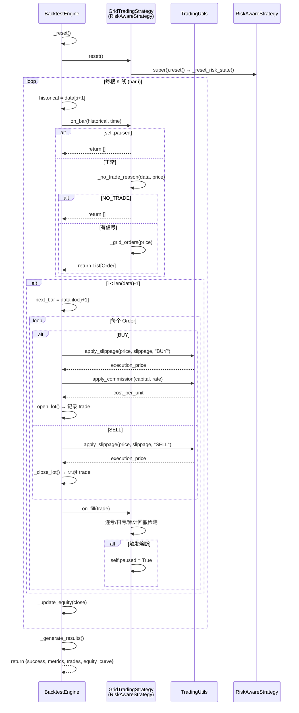
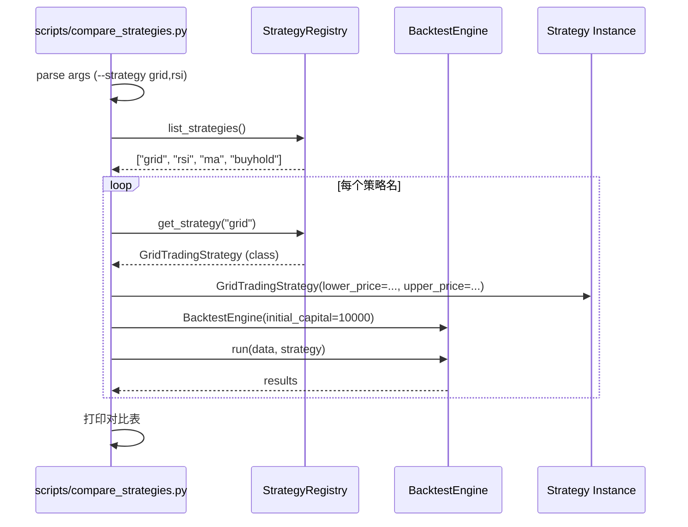
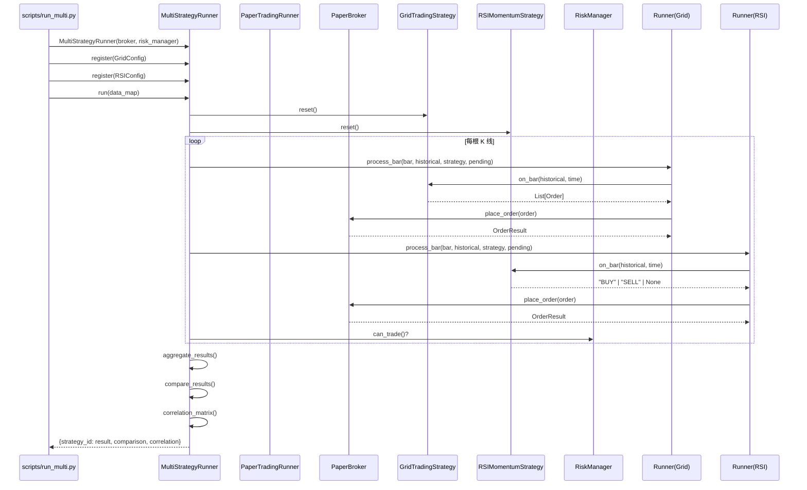
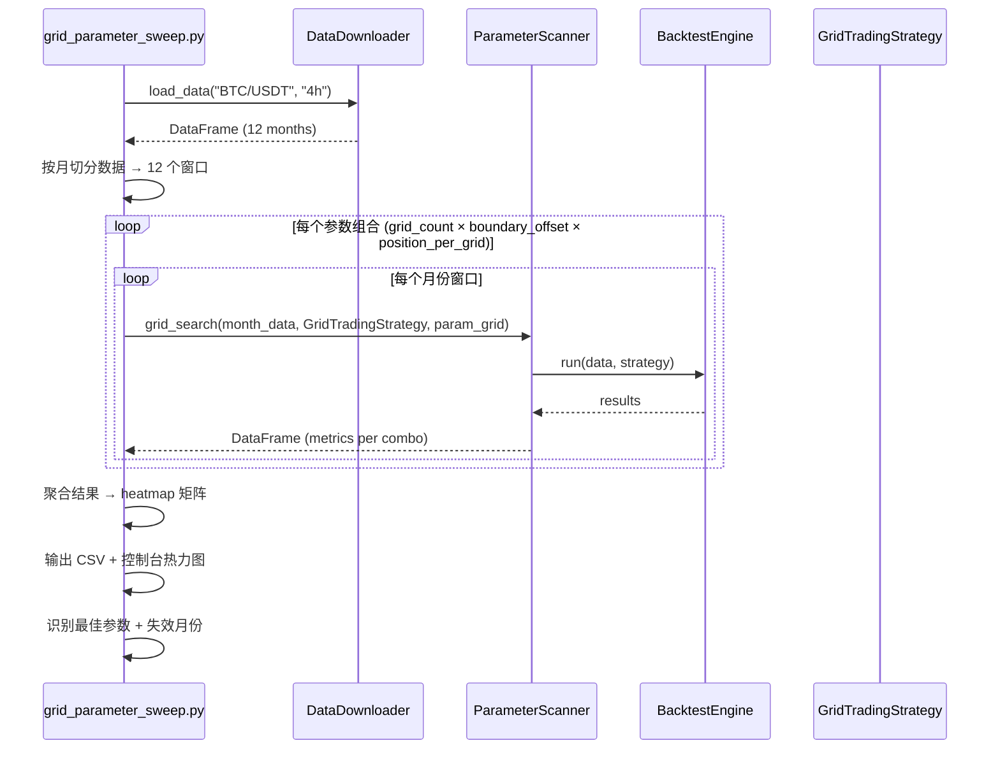
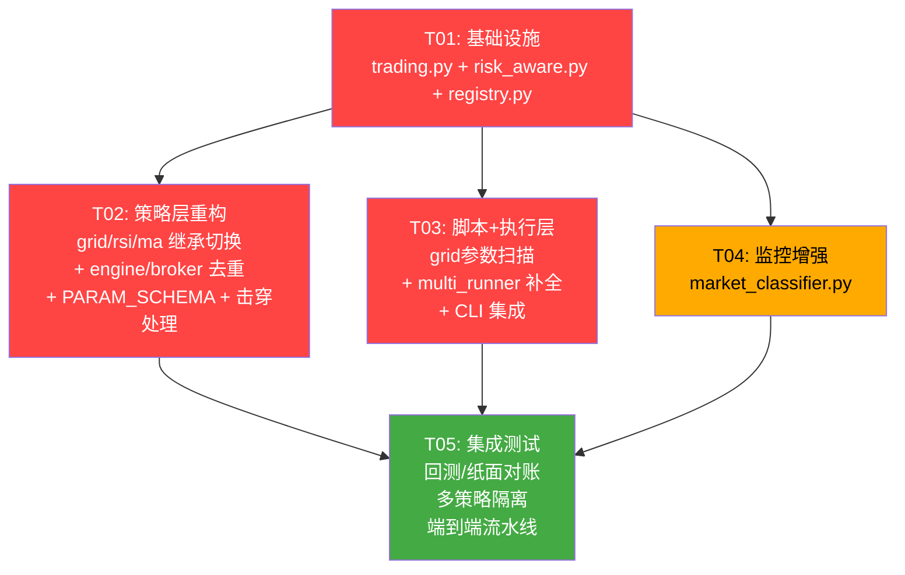

# 系统优化设计方案 — crypto-trading-system

**文档版本：** v1.0
**设计者：** Bob (Architect)
**创建日期：** 2026-06-20
**基于：** OPTIMIZATION_ROADMAP.md v1.0 + 现有代码库探索报告

---

## Part A: 系统设计

### 1. 实现方案

#### 1.1 核心技术挑战

| 挑战 | 描述 | 严重程度 |
|------|------|----------|
| **熔断逻辑重复** | `on_fill()` 中的连亏计数、日亏熔断、PAUSE 管理在三份策略中逐字相同。新增第 4 个策略只能复制粘贴 | 🔴 阻塞 |
| **策略发现耦合** | 脚本硬编码 `import GridTradingStrategy` + 手动 dict 映射，新增策略需修改多处 | 🔴 阻塞 |
| **滑点/手续费计算重复** | `BacktestEngine` 和 `PaperBroker` 各自实现相同的滑点/手续费逻辑 | 🟡 中 |
| **网格未验证负收益原因** | 10 网格回测收益 -11.10%，缺少参数敏感性分析来区分策略缺陷与参数不当 | 🔴 阻塞 |
| **Multi-Runner 功能不完备** | 缺少结果对比表、相关性矩阵、资金隔离 | 🟡 中 |
| **策略参数无校验** | 参数散落在 `__init__` 中，无 Schema，AI 调参无参考 | 🟡 中 |

#### 1.2 架构决策

**A. RiskAwareStrategy 继承层级**

当前继承链：
```
Strategy (ABC)
├── GridTradingStrategy
├── RSIMomentumStrategy
├── SimpleMAStrategy
└── BuyAndHoldStrategy
```

目标继承链：
```
Strategy (ABC)
└── RiskAwareStrategy (new — 熔断基类)
    ├── GridTradingStrategy  (去掉 on_fill 熔断代码)
    ├── RSIMomentumStrategy  (去掉 on_fill 熔断代码)
    ├── SimpleMAStrategy     (去掉 on_fill 熔断代码)
    └── BuyAndHoldStrategy   (不需要熔断，仍直接继承 Strategy)
```

**关键设计决策：**
- `RiskAwareStrategy` 将 `paused` / `consecutive_losses` / `daily_pnl` / `current_day` 统一为公开属性（保持与现有代码的直接访问模式兼容）
- `on_fill()` 在基类中实现，子类**不需要**覆盖
- `_reset_risk_state()` 提供重置入口，子类的 `reset()` 调用 `super().reset()` 即可
- `BuyAndHoldStrategy` 保持不变（它无熔断需求，不需要 `on_fill`）

**B. 策略注册表**

采用**显式注册表**（非自动发现/importlib）：
- 显式导入所有策略类
- 字典映射 `name → class`
- 提供 `get_strategy(name)` 和 `list_strategies()` 函数
- 脚本统一通过 `--strategy <name>` CLI 参数选择

理由：显式注册表比 `importlib` 自动发现更可靠、可读、可测试。自动发现在打包/CI 环境中容易失效。

**C. 工具函数去重**

新建 `src/utils/trading.py`，提供纯函数：
- `apply_slippage(price, slippage_pct, side)` → float
- `apply_commission(capital, rate)` → float

BacktestEngine 和 PaperBroker 改用这两个函数。

**D. 网格参数扫描**

利用已有 `ParameterScanner.grid_search()`，编写独立脚本 `scripts/grid_parameter_sweep.py`：
- 参数组合：grid_count × boundary_offset × position_per_grid
- 按月份窗口分别回测
- 输出 CSV 结果矩阵 + 控制台 heatmap（ASCII）
- 不修改任何核心代码

### 2. 文件列表

#### 2.1 新建文件

| 文件 | 用途 | 优先级 |
|------|------|--------|
| `src/utils/trading.py` | 统一滑点/手续费计算函数 | P0 |
| `src/strategy/risk_aware.py` | 带熔断的策略基类 `RiskAwareStrategy` | P0 |
| `src/strategy/registry.py` | 策略注册表 + `get_strategy()` / `list_strategies()` | P0 |
| `scripts/grid_parameter_sweep.py` | 网格参数敏感性扫描脚本 | P0 |
| `src/monitor/market_classifier.py` | 市场状态分类器（P2-2） | P2 |
| `tests/integration/test_backtest_paper_parity.py` | 回测 vs 纸面交易一致性集成测试 | P2 |
| `tests/integration/test_multi_strategy_isolation.py` | 多策略并行无状态污染集成测试 | P2 |
| `tests/integration/test_e2e_pipeline.py` | 数据下载→质量检查→回测全链路测试 | P2 |

#### 2.2 修改文件

| 文件 | 修改内容 | 优先级 |
|------|----------|--------|
| `src/strategy/__init__.py` | 新增 `RiskAwareStrategy` 导出 + registry 统一入口 | P0 |
| `src/utils/__init__.py` | 新增 `apply_slippage` / `apply_commission` 导出 | P0 |
| `src/strategy/grid_trading.py` | 继承 `RiskAwareStrategy`，删除 `on_fill`；新增 `PARAM_SCHEMA`；新增 `_check_boundary_breach()` | P0/P1 |
| `src/strategy/rsi_momentum.py` | 继承 `RiskAwareStrategy`，删除 `on_fill`；新增 `PARAM_SCHEMA` | P0/P1 |
| `src/strategy/simple_ma.py` | 继承 `RiskAwareStrategy`，删除 `on_fill`；新增 `PARAM_SCHEMA` | P0/P1 |
| `src/backtest/engine.py` | `_execute_buy` / `_execute_sell` / `_open_lot` / `_close_lot` 改用 `src.utils.trading` 函数 | P1 |
| `src/execution/paper_broker.py` | `_fill_order` 改用 `src.utils.trading` 函数 | P1 |
| `src/execution/multi_runner.py` | 新增 `compare_results()` 对比表输出；新增 `correlation_matrix()` 相关性矩阵；新增独立资金池模式 | P1 |
| `src/monitor/__init__.py` | 新增 `MarketClassifier` 导出 | P2 |
| `scripts/compare_strategies.py` | 改用 `get_strategy(name)` 替代硬编码 import | P0 |
| `scripts/run_paper_trading.py` | 改用 `get_strategy("grid")` 替代硬编码 import | P0 |

### 3. 数据结构和接口

```mermaid
classDiagram
    class Strategy {
        <<abstract>>
        +str name
        +dict parameters
        +on_bar(data, current_time)* Order|str|None
        +on_fill(trade) None
        +reset() None
        +set_parameters(**kwargs) None
    }

    class Order {
        +str side
        +object tag
        +float fraction
        +float? limit_price
    }

    class RiskAwareStrategy {
        +int _max_consecutive_losses
        +float _max_daily_loss_pct
        +float _initial_capital
        +int consecutive_losses
        +bool paused
        +object current_day
        +float daily_pnl
        +on_fill(trade) None
        +_reset_risk_state() None
        +_is_paused() bool
    }

    class GridTradingStrategy {
        +float lower_price
        +float upper_price
        +int grid_count
        +float position_per_grid
        +bool enable_filters
        +Dict PARAM_SCHEMA$
        +on_bar(data, current_time) List~Order~
        +_check_boundary_breach(current_price) Tuple
        +_grid_orders(current_price) List~Order~
        +_no_trade_reason(data, price) str?
        +reset() None
        +get_grid_status() dict
    }

    class RSIMomentumStrategy {
        +int rsi_period
        +float oversold
        +float overbought
        +int ema_period
        +bool enable_trend_filter
        +Dict PARAM_SCHEMA$
        +on_bar(data, current_time) str?
        +reset() None
    }

    class SimpleMAStrategy {
        +int short_window
        +int long_window
        +Dict PARAM_SCHEMA$
        +on_bar(data, current_time) str?
        +reset() None
    }

    class BuyAndHoldStrategy {
        +bool has_bought
        +int bar_count
        +Dict PARAM_SCHEMA$
        +on_bar(data, current_time) str?
        +reset() None
    }

    class DonchianChannelStrategy {
        +int period
        +Dict PARAM_SCHEMA$
        +on_bar(data, current_time) str?
        +reset() None
    }

    class MarketStructureStrategy {
        +int lookback
        +Dict PARAM_SCHEMA$
        +on_bar(data, current_time) str?
        +reset() None
    }

    class SuperTrendStrategy {
        +int atr_period
        +float multiplier
        +Dict PARAM_SCHEMA$
        +on_bar(data, current_time) str?
        +reset() None
    }

    class KeyLevelReversalStrategy {
        +int lookback
        +float threshold
        +Dict PARAM_SCHEMA$
        +on_bar(data, current_time) str?
        +reset() None
    }

    class StrategyRegistry {
        +dict STRATEGY_REGISTRY$
        +get_strategy(name) type
        +list_strategies() list
    }

    class TradingUtils {
        +apply_slippage(price, slippage_pct, side) float$
        +apply_commission(capital, rate) float$
    }

    class BacktestEngine {
        +float initial_capital
        +float commission
        +float slippage
        +dict lots
        +list trades
        +list equity_curve
        +run(data, strategy) dict
        +_execute_buy(price, time, strategy) None
        +_execute_sell(price, time, strategy) None
        +_open_lot(order, price, time, strategy) None
        +_close_lot(order, price, time, strategy) None
    }

    class PaperBroker {
        +float balance
        +float commission
        +dict slippage
        +dict positions
        +place_order(order, timestamp) OrderResult
        +_fill_order(order, exec_price, timestamp) OrderResult
        +check_pending_orders(bar_high, bar_low, timestamp) List
    }

    class MultiStrategyRunner {
        +RunnerBroker broker
        +RiskManager risk_manager
        +register(config) None
        +run(data_map) dict
        +aggregate_results() dict
        +compare_results() DataFrame
        +correlation_matrix() DataFrame
    }

    class RiskManager {
        +str state
        +float capital_base
        +can_trade() bool
        +record_fill(trade) None
        +emergency_stop(reason) None
        +resume() bool
    }

    class MarketClassifier {
        +classify_market(df) str$
        +get_market_regime(df) dict$
    }

    class ParameterScanner {
        +grid_search(data, strategy_class, param_grid) DataFrame
        +sensitivity_analysis(data, strategy_class, base_params, test_param, variations) DataFrame
        +walk_forward(data, strategy_class, param_grid, n_windows, in_sample_ratio) DataFrame
    }

    Strategy <|-- RiskAwareStrategy : inherits
    RiskAwareStrategy <|-- GridTradingStrategy : inherits
    RiskAwareStrategy <|-- RSIMomentumStrategy : inherits
    RiskAwareStrategy <|-- SimpleMAStrategy : inherits
    RiskAwareStrategy <|-- DonchianChannelStrategy : inherits
    RiskAwareStrategy <|-- MarketStructureStrategy : inherits
    RiskAwareStrategy <|-- SuperTrendStrategy : inherits
    RiskAwareStrategy <|-- KeyLevelReversalStrategy : inherits
    RiskAwareStrategy <|-- BuyAndHoldStrategy : inherits
    
    BacktestEngine ..> TradingUtils : uses
    PaperBroker ..> TradingUtils : uses
    BacktestEngine --> RiskAwareStrategy : calls on_fill
    MultiStrategyRunner --> RiskManager : uses
    MultiStrategyRunner --> PaperBroker : uses
    StrategyRegistry --> Strategy : maps
    GridTradingStrategy ..> Order : creates
```



### 4. 程序调用流程

#### 4.1 回测引擎 Bar-by-Bar 流程（改造后）



#### 4.2 策略注册表 + CLI 调用流程



#### 4.3 Multi-Runner 多策略并行回测 + 对比



#### 4.4 网格参数扫描流程



### 5. 待明确事项

| # | 问题 | 当前假设 | 影响 |
|---|------|----------|------|
| 1 | `BuyAndHoldStrategy` 是否也需要继承 `RiskAwareStrategy`？ | **已确认：是**。实际代码中 `BuyAndHoldStrategy` 已继承 `RiskAwareStrategy`（含熔断能力，虽然 BuyAndHold 策略本身较少触发） | 低 |
| 2 | GridTrading 的 `_has_data_anomaly()` 设置 `self.paused` — 这个逻辑是否也应该移到 `RiskAwareStrategy`？ | **不移**。数据异常检测是 Grid 特有的过滤器逻辑（`no_trade_reason` 链的一部分），与通用的盈亏熔断不同 | 低 |
| 3 | `MultiStrategyRunner` 当前共享 `broker`（共享现金池）。P1-1 要求"各策略独立资金账户"，这是否意味着需要改为每个策略独立 Broker？ | **是**。新增 `PoolMode.SHARED` vs `PoolMode.ISOLATED` 模式。隔离模式下每个 `StrategySlot` 创建独立 `PaperBroker` | 中 |
| 4 | 网格参数扫描是否需要精确的 48 组组合 × 12 个月 = 576 次回测？ | **是**。使用 `ParameterScanner` 已有的并行 `ProcessPoolExecutor` 加速 | 中 |
| 5 | `CircuitBreaker` 异常是否需要在 `RiskAwareStrategy.on_fill` 中 raise？ | **不**。沿用现有模式：设置 `self.paused = True` + `logger.warning()`，不引入新异常类型。现有代码中 `on_bar` 在开头检查 `self.paused` 并 `return []`/`None` | 低 |

---

## Part B: 任务分解

### 6. 依赖包

无需新增第三方依赖。所有功能使用现有依赖：

```
# 现有依赖（不变）
- pandas: 数据处理
- numpy: 数值计算
- python-dateutil: 时间处理
- ccxt: 交易所数据（网格参数扫描脚本可能用到）
```

网格参数扫描脚本可选依赖（用于生成 PNG 热力图）：
```
- matplotlib>=3.7.0: 热力图可视化（可选，脚本可仅输出 CSV + ASCII heatmap）
```

### 7. 任务列表

#### T01: 项目基础设施 — 工具函数 + 熔断基类 + 注册表

| 属性 | 值 |
|------|-----|
| **Task ID** | T01 |
| **优先级** | P0 |
| **依赖** | 无 |
| **预估工时** | 2-3h |

**源文件：**
- `src/utils/trading.py` — **新建**：`apply_slippage()` / `apply_commission()` 纯函数
- `src/strategy/risk_aware.py` — **新建**：`RiskAwareStrategy(Strategy)` 基类，统一 `on_fill()` 熔断逻辑 + `_reset_risk_state()`
- `src/strategy/registry.py` — **新建**：`STRATEGY_REGISTRY` 字典 + `get_strategy()` + `list_strategies()`
- `src/strategy/__init__.py` — **修改**：新增 `RiskAwareStrategy` 导出；同时从 registry 导入并在 `__all__` 中暴露注册表函数
- `src/utils/__init__.py` — **修改**：新增 `apply_slippage` / `apply_commission` 导出

**详细规格：**

`src/utils/trading.py`:
```python
def apply_slippage(price: float, slippage_pct: float, side: str) -> float:
    """统一滑点计算。BUY: price*(1+slippage), SELL: price*(1-slippage)"""
    
def apply_commission(capital: float, rate: float) -> float:
    """统一手续费计算。返回 capital * (1 - rate)"""
```

`src/strategy/risk_aware.py`:
```python
class RiskAwareStrategy(Strategy):
    def __init__(self, name, max_consecutive_losses=3, max_daily_loss_pct=0.02,
                 initial_capital=10000.0):
        super().__init__(name=name)
        self._max_consecutive_losses = max_consecutive_losses
        self._max_daily_loss_pct = max_daily_loss_pct
        self._initial_capital = initial_capital
        self.consecutive_losses = 0
        self.paused = False
        self.current_day = None
        self.daily_pnl = 0.0
    
    def on_fill(self, trade: dict) -> None:
        """统一熔断：连亏检测 + 日亏检测"""
        # 实现与现有三策略 on_fill 完全一致的逻辑
        # 日志前缀用 self.name 区分
    
    def _reset_risk_state(self) -> None:
        """重置风险状态，子类 reset() 中调用 super().reset()"""
        self.consecutive_losses = 0
        self.paused = False
        self.current_day = None
        self.daily_pnl = 0.0
```

`src/strategy/registry.py`:
```python
STRATEGY_REGISTRY: dict[str, type[Strategy]] = {
    "grid": GridTradingStrategy,
    "rsi": RSIMomentumStrategy,
    "ma": SimpleMAStrategy,
    "buyhold": BuyAndHoldStrategy,
    "donchian": DonchianChannelStrategy,
    "structure": MarketStructureStrategy,
    "supertrend": SuperTrendStrategy,
    "reversal": KeyLevelReversalStrategy,
}

def get_strategy(name: str) -> type[Strategy]:
    ...

def list_strategies() -> list[str]:
    ...
```

---

#### T02: 策略层重构 — 继承切换 + 滑点去重 + Schema + 击穿

| 属性 | 值 |
|------|-----|
| **Task ID** | T02 |
| **优先级** | P0/P1 |
| **依赖** | T01（RiskAwareStrategy / TradingUtils 必须先存在） |
| **预估工时** | 3-4h |

**源文件：**
- `src/strategy/grid_trading.py` — **修改**：
  - 继承 `RiskAwareStrategy` 替代 `Strategy`
  - 删除 `on_fill()` 方法（基类已提供）
  - 删除 `_init_state()` 中的 `consecutive_losses` / `paused` / `current_day` / `daily_pnl` 初始化（改为调用 `self._reset_risk_state()`）
  - `reset()` 中调用 `super().reset()`（触发 `_reset_risk_state()`）
  - 新增类属性 `PARAM_SCHEMA`
  - 新增 `_check_boundary_breach(current_price)` 方法（P1-4）
  - `on_bar()` 开头在 `paused` 检查前，先调用 `_check_boundary_breach()`；若返回 `LIQUIDATE`，记录日志并返回 `[]`

- `src/strategy/rsi_momentum.py` — **修改**：
  - 继承 `RiskAwareStrategy` 替代 `Strategy`
  - 删除 `on_fill()` 方法
  - 删除 `_init_state()` 中的 `consecutive_losses` / `paused` / `current_day` / `daily_pnl`
  - `reset()` 调用 `super().reset()`
  - 新增类属性 `PARAM_SCHEMA`

- `src/strategy/simple_ma.py` — **修改**：
  - 继承 `RiskAwareStrategy` 替代 `Strategy`
  - 删除 `on_fill()` 方法
  - 删除 `_init_state()` 中的 `consecutive_losses` / `paused` / `current_day` / `daily_pnl`
  - `reset()` 调用 `super().reset()`
  - 新增类属性 `PARAM_SCHEMA`

- `src/backtest/engine.py` — **修改**：
  - `_execute_buy()` 中：用 `apply_slippage(price, self.slippage, "BUY")` 替代 `price * (1 + self.slippage)`
  - `_execute_sell()` 中：用 `apply_slippage(price, self.slippage, "SELL")` 替代 `price * (1 - self.slippage)`
  - `_open_lot()` 中：同上修改滑点计算
  - `_close_lot()` 中：同上修改滑点计算
  - 导入 `from src.utils.trading import apply_slippage, apply_commission`

- `src/execution/paper_broker.py` — **修改**：
  - `_fill_order()` 中：用 `apply_slippage(exec_price, slippage_pct, order.side)` 替代内联的 `exec_price * (1 ± slippage_pct)`
  - 导入 `from src.utils.trading import apply_slippage, apply_commission`

**关键注意事项：**
- 切换继承后，GridTradingStrategy 的 `_init_state()` 必须显式调用 `self._reset_risk_state()`，同时保留网格特有状态（`grid_filled`, `last_price`, EMA/ATR 缓存）
- `RSIMomentumStrategy` 和 `SimpleMAStrategy` 的 `_init_state()` 同样需调用 `self._reset_risk_state()`
- `on_bar()` 中 `if self.paused: return` 的检查保持不变（`self.paused` 是 `RiskAwareStrategy` 的公开属性）
- 所有修改后运行 `pytest tests/unit/ -x` 确保 44 个测试文件全部通过

---

#### T03: 脚本与执行层增强 — 网格参数扫描 + Multi-Runner 补全 + CLI 集成

| 属性 | 值 |
|------|-----|
| **Task ID** | T03 |
| **优先级** | P0/P1 |
| **依赖** | T01（Registry 必须先存在），T02 建议先完成（策略继承已切换，扫描结果更准确） |
| **预估工时** | 4-5h |

**源文件：**
- `scripts/grid_parameter_sweep.py` — **新建**：
  - 用 `DataDownloader` 加载 BTC/USDT 4h 数据（12 个月）
  - 按月切分数据（每月一个子 DataFrame）
  - 参数组合：`grid_count` [5, 10, 15, 20] × `boundary_offset` [0.10, 0.15, 0.20] × `position_per_grid` [0.03, 0.05, 0.08, 0.10] = 4×3×4 = 48 组
  - 每组在每月窗口回测，共 48×12 = 576 次回测
  - 使用 `ParameterScanner(max_workers=4).grid_search()` 并行加速（仅限网格搜索维度，月份维度串行）
  - 输出：`data/reports/grid_sweep_results.csv`（所有组合的原始数据）
  - 输出：控制台 ASCII heatmap（每月每组合的收益率矩阵）
  - 输出：最佳参数组合推荐 + 策略失效月份列表

- `src/execution/multi_runner.py` — **修改**：
  - 新增资金池模式：`PoolMode` 枚举（`SHARED` / `ISOLATED`）
  - 隔离模式：每个 `StrategySlot` 创建独立 `PaperBroker`
  - 新增 `compare_results()` 方法：返回 DataFrame（策略名称、收益率、夏普、最大回撤、胜率、总交易数）
  - 新增 `correlation_matrix()` 方法：基于各策略的日收益序列计算相关性矩阵（返回 DataFrame）
  - `aggregate_results()` 中新增各策略独立统计

- `scripts/compare_strategies.py` — **修改**：
  - 移除硬编码的 `from src.strategy.simple_ma import SimpleMAStrategy` 等
  - 改用 `from src.strategy.registry import get_strategy, list_strategies`
  - 支持 `--strategies grid,rsi,ma` CLI 参数
  - 支持 `--list` 列出所有可用策略

- `src/backtest/param_scanner.py` — **修改**（可选）：
  - 仅当 `grid_search()` 需要支持按月窗口拆分参数扫描时才修改
  - 实际上不需要修改：脚本层负责按月拆分，每次调用 `grid_search()` 传一个月的数据即可

---

#### T04: 监控增强 + 市场分类器 (P2-2 + P2-3)

| 属性 | 值 |
|------|-----|
| **Task ID** | T04 |
| **优先级** | P2 |
| **依赖** | T01（基础模块就绪） |
| **预估工时** | 2-3h |

**源文件：**
- `src/monitor/market_classifier.py` — **新建**：
  - `classify_market(df: pd.DataFrame) -> str`：基于近 20 天数据分析市场状态
    - 用 ADX 判断趋势强度
    - 用 EMA20 vs EMA50 斜率判断方向
    - 用布林带宽度判断波动率
    - 返回 `'trending_up'` | `'trending_down'` | `'ranging'` | `'volatile'`
  - `get_market_regime(df: pd.DataFrame) -> dict`：返回详细指标字典

- `src/monitor/__init__.py` — **修改**：新增 `MarketClassifier` 导出

- `scripts/compare_strategies.py` — **修改**（追加）：
  - 在回测前调用 `MarketClassifier.classify_market(data)` 打印市场状态建议
  - 帮助用户判断当前适合跑网格还是趋势策略

**注意：** P2-3 性能基准标记不在此任务中——这属于项目测量活动，不是代码变更。

---

#### T05: 集成测试 + 最终验证

| 属性 | 值 |
|------|-----|
| **Task ID** | T05 |
| **优先级** | P2 |
| **依赖** | T01, T02, T03, T04（所有代码变更完成后） |
| **预估工时** | 2-3h |

**源文件：**
- `tests/integration/test_backtest_paper_parity.py` — **新建**：
  - 用同一份震荡数据 + 同一策略（GridTrading）
  - 分别跑 `BacktestEngine` 和 `PaperTradingRunner`
  - 断言：总收益率偏差 < 1%（BacktestEngine 和 PaperBroker 的交易逻辑应高度一致）

- `tests/integration/test_multi_strategy_isolation.py` — **新建**：
  - 用 `MultiStrategyRunner` 跑 2 个策略
  - 断言：各策略状态不互相污染（`paused` 独立，`realized_pnl` 独立）

- `tests/integration/test_e2e_pipeline.py` — **新建**：
  - 端到端：数据下载 → 质量检查 → 回测
  - 验证数据不为空、回测产出 trades 和 equity_curve
  - 不作为 CI 必跑项（依赖外部数据下载），标记 `@pytest.mark.slow`

- `tests/conftest.py` — **修改**（可选）：
  - 添加 `--run-slow` 和 `--run-integration` CLI 选项（若尚未存在）

**最终验证步骤：**
```bash
# 1. 全量单元测试
pytest tests/unit/ -v --tb=short

# 2. 集成测试（仅当指定时）
pytest tests/integration/ -v --run-integration

# 3. 冒烟测试：确认注册表可用
python -c "from src.strategy.registry import list_strategies; print(list_strategies())"

# 4. 确认策略可正常实例化
python -c "from src.strategy.registry import get_strategy; G=get_strategy('grid'); s=G(lower_price=100,upper_price=200); print(s.name)"
```

### 8. 共享知识 (Shared Knowledge)

**代码风格约定：**
```
- 所有策略类必须实现 reset()，并调用 super().reset()
- 日志中策略名称用 self.name 而非硬编码字符串
- 参数校验在 __init__ 中完成，抛 ValueError
- PARAM_SCHEMA 为类属性，格式: {param: {type, min, max, default}}
```

**数据结构约定：**
```
- trade 字典必须包含: time, type, price, quantity
- 卖出 trade 还必须包含: profit, cost_price
- 所有金额以 USDT 计，保留 6 位小数精度
- 所有时间戳为 pandas Timestamp，日期比较用 .date()
```

**测试约定：**
```
- 单元测试放在 tests/unit/，集成测试放在 tests/integration/
- 使用 pytest 框架 + fixtures/conftest
- 回测数据用 scripts/generate_oscillating_data.py 生成的确定性数据
- 所有浮点断言使用 pytest.approx(rel=1e-6)
```

**Registry 约定：**
```
- 策略名全部小写、无空格（"grid", "rsi", "ma", "buyhold", "donchian", "structure", "supertrend", "reversal"）
- get_strategy(name) 对未知名称抛 ValueError
- 新增策略时只需在 STRATEGY_REGISTRY 中添加一行
```

**RiskAwareStrategy 约定：**
```
- 子类 __init__ 必须调用 super().__init__(name=..., max_consecutive_losses=..., ...)
- 子类 _init_state() 必须调用 self._reset_risk_state()
- 子类 on_bar() 开头优先检查 self.paused
- 子类不应覆盖 on_fill()（除非有特殊的额外逻辑需求）
```

### 9. 任务依赖图



**执行顺序建议：**
1. **T01 先行**（无依赖，是所有任务的基础）
2. **T02 紧随**（依赖 T01；完成后可立即跑全量测试确认无回归）
3. **T03 可与 T04 并行**（都依赖 T01，互不依赖）
4. **T05 最后**（依赖所有前序任务完成后验证）

---

**文档状态：** ✅ 设计完成，已全部实现  
**下一步：** ✅ 全部已完成（T01→T02→T03/T04→T05 已于 2026-06-20 前执行完毕）
