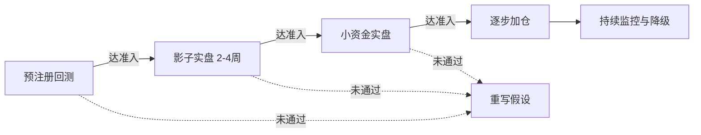

以下是合并后的 V1 最终规格书。

---

# V1 趋势策略最终规格书（合并版）

**定位**：可直接翻译成代码的 V1 工程规格。以 Opus 4.8 为骨架，融合 GPT 5.5 的工程细节和回测评估维度。边界已锁死，不再发散。

---

## 一、定位：先想清楚 V1 是什么、不是什么

这套 EMA + MACD + RSI + 布林 + ADX 的组合是经典技术分析的标准件，BTC/ETH 上每天有数以万计的同类策略在跑。**必须承认：它本身不是你的 alpha，它是你的 baseline**。真正的差异化优势（资金费率、未平仓合约等衍生品维度，或多策略组合分散）一律推迟到 V2/V3。

V1 的唯一使命，是建立一个干净、可信、可归因的基准，以及一条不会自欺的研究执行流水线。所以 **V1 的成功标准不是收益率**，而是回答一个问题：我这条从回测到实盘的管线，会不会骗我？

整个项目分三步走，边界事先划死，防止范围蔓延：

| 版本 | 目标 | 核心动作 | 关键约束 |
|------|------|---------|---------|
| V1 | 验证流水线可信、baseline 可行 | 纯 TA、只做多、硬过滤、默认参数 | 不优化、不加维度、不做空 |
| V2 | 在 baseline 上加边际优势 | 接资金费率/OI、对照测 ADX 自适应出场、评估做空 | 每次只改一个大变量 |
| V3 | 走向多策略组合 | 加入弱相关策略、组合级风控升级 | 有第二套能赚钱的策略后再抽象框架 |

---

## 二、V1 策略规格

### 指标体系（全部教科书默认参数，V1 不优化任何阈值）

优化正是自欺的入口，V1 阶段所有指标参数用默认值。

| 维度 | 指标 | 参数 | 职能 |
|------|------|------|------|
| 状态识别 | ADX | 14 | 总开关，决定是否启用策略 |
| 大方向 | 日线 EMA | 50 | 方向锚 |
| 趋势方向 | EMA 双线 | 50 / 200（H4） | 多空排列确认 |
| 动量触发 | MACD | 12, 26, 9 | 主入场扳机 |
| 位置过滤 | RSI | 14 | 避免追高 |
| 波动率位置 | 布林带 | 20, 2 | 趋势恢复确认 |
| 量能确认 | 成交量均线 | 20 | 资金支撑确认 |
| 止损仓位 | ATR | 14 | 动态止损与仓位 |

### 多周期分工

| 周期 | 角色 | 规则 |
|------|------|------|
| 日线 D1 | 方向锚 | 日线 EMA50 向上时才允许做多，向下时禁止 |
| H4 | 信号主周期 | 所有共振条件在此判断 |
| H1 | 入场精修 | H4 信号触发后，在 H1 等待回调至 EMA21 附近入场 |

多周期结构顺带补偿了 ADX 的滞后——日线已趋势化时，H4 的 ADX 门槛可放宽至 20。

### 做多信号（硬过滤，六条全满足才触发；V1 只做多）

1. **状态层**：ADX(14) > 25
2. **方向层**：日线 EMA50 向上 + H4 EMA50 > EMA200（多头排列）
3. **动量层**：MACD 金叉（DIF 上穿 DEA）或柱状图由负转正
4. **位置层**：RSI(14) 处于 40–60 区间且拐头向上——避开 RSI > 70 的追高区，要的是趋势中健康回调后的动量恢复
5. **波动率层**：收盘价站上布林中轨（趋势延续确认）
6. **量能层**：当前成交量 > 20 周期均量

### 出场规则（V1 固定一套，不做 ADX 自适应分档）

| 出场类型 | 规则 |
|---------|------|
| 初始止损 | 入场价 − 1.5 × ATR(14) |
| 第一止盈 | 盈利达 1.5 × ATR 时平仓 50%，锁定部分利润 |
| 剩余仓位 | 移动止损跟踪，盈利超 1 × ATR 后止损上移至保本价 |
| 信号反转强平 | MACD 出现反向交叉，或 RSI > 75，无条件离场 |
| 时间止损 | 开仓后 8–12 根 H4 K 线（约 2–3 天）仍未达 1 × ATR 盈利，无条件平仓 |
| **休眠继承** | 持仓期间若 ADX 跌破休眠阈值，切换为"时间优先"退出——止损收紧到保本附近，2–3 根 K 线内强制了结。这是让趋势策略干净了结趋势市留下的头寸，而不是在震荡市里继续用趋势工具管理它 |

### 仓位计算（固定风险百分比，非固定仓位比例）

每笔交易的最大亏损恒为账户权益的 1%，与币种波动率无关：

$$
\text{下单量} = \frac{\text{账户权益} \times 1\%}{|\,\text{入场价} - \text{止损价}\,|}
$$

ATR 大时止损距离远、仓位自动变小；ATR 小时仓位适当变大。每笔真实风险恒定。

### 币种池与选币规则

V1 只在 BTC/USDT、ETH/USDT 上跑。多币信号扎堆时，**按相关性分散选币**——选最不重叠的风险，不选最漂亮的信号。

---

## 三、三层风险控制

加密市场的相关性是状态依赖的：系统性下跌时，各币种、各策略的相关性会瞬间冲到接近 1。**你最需要分散保护的时候恰恰是分散失效的时候**。真正救命的是组合级总敞口熔断，不是分散本身。

| 层级 | 锁定规则 |
|------|---------|
| **单笔** | 单笔风险 ≤ 权益 1%，ATR 动态止损 |
| **策略** | 日亏损 5% 当天停手；周亏损 10% 暂停复盘；连续 N 笔亏损自动降仓 |
| **组合** | 同时持仓 ≤ 3 个低相关币种；同方向总风险设硬顶；组合总回撤熔断架在账户层而非策略层 |

---

## 四、验证流水线（每一环准入标准事先写死）

### 第一环：预注册式回测

跑回测之前先签一份不可修改的「策略契约」（见第五章），把币种池、时间范围（至少 2–3 年，覆盖牛市/熊市/震荡市）、参数、成本假设、回测次数预算（≤ 20 次）、圣域数据（留 30% 到最后才看一眼）全部锁定。

回测次数预算不是建议，是硬约束——逼自己每次跑之前想清楚假设。跑完无论结果好坏，**不要马上调参数**，先回答三个归因问题再决定下一步：

- 信号触发频率是否与预期一致？
- 盈亏来源是否和设计意图一致？
- 亏损是集中出现还是均匀分布？

### 第二环：影子实盘（2–4 周）

策略在真实行情下实时运行，下虚拟单但记录真实订单簿环境下的可成交价格、API 响应时间、滑点。产出**执行损耗报告**，比较理论成交价与实际可成交价的偏差。影子实盘比小资金实盘更有价值，因为小资金的市场冲击和真实仓位不在一个量级。

### 第三环：小资金实盘

用可承受全损的资金（100–500 USDT）验证 API 稳定性、延迟、真实滑点、断网恢复。

### 第四环：逐步加仓

小资金实盘稳定运行指定周期后，按预设节奏逐步加仓。**上线后至少 3 个月内不允许改任何参数。**

---

## 五、策略契约（事先签字、事后不可修改）

这张表是整份方案里最关键的一块。事后挪门球的最大动力来自亏损情绪和沉没成本，事前定的数字是冷静的你和热血的你之间的契约。

| 项目 | 必须事先写死的内容 |
|------|-------------------|
| **假设** | 趋势市中顺势做多能盈利，震荡市休眠保本 |
| **币种池** | BTC/USDT、ETH/USDT（提前确定，不根据结果增删） |
| **时间范围** | 至少 2–3 年，覆盖牛市/熊市/震荡市 |
| **参数** | 全部教科书默认值，不优化 |
| **成本** | 手续费 0.07% + 滑点模拟 + 资金费率（如适用） |
| **回测次数预算** | 最多 20 次，每次跑前先写清楚假设 |
| **圣域数据** | 切出 30% 数据到最后才看一眼，前面探索不许碰 |
| **回测准入** | 见下方「回测评估十维度」 |
| **影子准入** | 滑点偏离回测假设的容忍上限；信号一致性下限 |
| **实盘准入** | 起始资金、加仓节奏 |
| **降仓触发** | 滚动 30 天回撤超阈值 → 仓位砍半；连续 N 笔亏损 → 暂停 N 天 |
| **死亡触发** | 累计回撤超死亡线，或滚动 60 天盈亏比低于回测基准 50% → 无条件下线 |
| **修改窗口** | 上线后 ≥ 3 个月禁止改参数 |

### 回测评估十维度（GPT 5.5 补充）

回测不要只看最终收益率。收益率最容易误导——一两笔大趋势交易可能掩盖大量低质量信号。以下十个维度必须在回测报告中逐项审视：

| 维度 | 需要回答的问题 |
|------|-------------|
| **样本量** | 交易笔数是否足够支撑统计判断？有效笔数太少则一切指标无意义 |
| **最大回撤** | 最差阶段是否在你的承受范围内？回撤深度 × 回撤时长两个维度都要看 |
| **盈亏比** | 单笔平均盈利是否足够覆盖平均亏损？盈亏比 < 1.5 需要警惕 |
| **胜率** | 信号过滤是否真的提高了质量？纯随机入场在趋势市中胜率也不低 |
| **连续亏损** | 最长连亏笔数是多少？是否需要更严格的熔断？ |
| **持仓时间** | 平均持仓是否符合 H4 趋势策略预期（几小时到几天，而非几分钟或几周）？ |
| **信号频率** | 每月触发多少次？太少导致统计意义不足，太多暗示过滤过松 |
| **成本占比** | 手续费和滑点是否吃掉了大部分利润？成本占比 > 30% 则策略不可执行 |
| **市场阶段** | 利润是否只来自某一段牛市？按季度拆开看，每个阶段的 PnL 分布 |
| **标的贡献** | BTC 和 ETH 的表现是否差异很大？如果只有一个品种赚钱，币种池要重想 |

**核心归因问题**：「利润是否来自你预期的环境」。如果策略声称是趋势策略，却主要在震荡反弹中赚钱，那策略假设并没有被验证。

---

## 六、生命周期管理（四档状态机，不做开/关二元决策）

直接关策略容易关在反转前夜。触发警报时**先降仓 + 复盘**，给自己留冷静期。

| 状态 | 触发条件 | 处理方式 |
|------|---------|---------|
| **正常** | 表现接近历史基准 | 标准运行 |
| **观察** | 信号频率偏离均值、盈亏比略降 | 不加仓，增强监控 |
| **降风险** | 滚动 30 天回撤超阈值、连续 N 笔亏损 | 仓位砍半，减少交易 |
| **暂停** | 累计回撤超死亡线、滚动 60 天盈亏比低于基准 50% | 停止新开仓，只管理已有仓位，人工复盘 |

---

## 七、归因日志（第一笔交易就必须完整记录）

事实层日志（信号、价格、滑点）只是底线。真正决定 3–6 个月后能否复盘的是**归因层日志**。

### 开仓时快照

- 日线 ADX、H4 ADX
- EMA50 与 EMA200 的距离
- 波动率分位数
- 当周 BTC 整体走势分类（单边涨 / 震荡 / 跌）
- 距上次信号间隔
- 账户近 10 笔胜负序列
- ATR 数值和止损距离
- 入场滑点

### 平仓时分类

退出原因归类为以下之一——只能归入一项，不能模糊：

- 第一止盈触发
- 移动止损触发
- 信号反转强平（MACD 反向 / RSI > 75）
- 时间止损
- 风控熔断
- 休眠继承退出
- 人工干预

### 复盘时的核心问题

3–6 个月后复盘，核心问题不是「赚了还是亏了」——看曲线就知道——而是：

**「盈亏来自什么样的市场环境，是不是和设计假设一致？」**

如果 80% 利润来自一段牛市里的两笔交易，那策略其实没被验证，你只是赌对了一段行情。没有归因日志，曲线会骗你；有归因日志，才能区分 alpha 和运气。

---

## 八、工程层底线（被严重低估的真实死因）

个人量化第一年的真实死因往往不是策略亏，是工程漏。

### 三条核心原则

1. **状态以交易所为准，本地为缓存。** 系统启动时第一件事是从交易所拉取真实持仓和挂单，与本地状态对账。不一致时，本地服从远端。
2. **幂等下单。** 每笔订单带客户端 ID，失败重试不造成重复开仓。
3. **异常即停。** 任何对账不一致、API 持续报错、推送长时间无响应——直接进入「只平仓不开仓」安全模式，等人工介入。

**宁可错过机会，不可在状态不明时硬干。**

### 九种必须处理的异常场景（GPT 5.5 补充）

以下每种场景，代码中必须有明确的检测逻辑和处理分支。不是「上线后再看看」，是上线前就必须逐条通过测试。

| # | 异常场景 | 必须实现的处理逻辑 |
|---|---------|------------------|
| 1 | 本地记录已平仓，但交易所仍有持仓 | 以交易所为准，标记异常，阻止新建同方向仓位 |
| 2 | 本地记录有持仓，但交易所没有持仓 | 清除本地状态，记录事件，告警 |
| 3 | 移动止损本地更新失败 | 重试机制；连续失败后切换为固定止损兜底 |
| 4 | 订单部分成交 | 更新实际成交量和剩余挂单状态，不做「全成交」假设 |
| 5 | 下单失败但本地状态被标记为已开仓 | 下单结果必须基于交易所返回确认，不能基于本地乐观假设 |
| 6 | API 延迟或限流 | 指数退避重试；超出阈值后进入安全模式 |
| 7 | 网络中断 | 断线期间所有新开仓信号作废；恢复后先对账再恢复交易 |
| 8 | 程序重启后状态丢失 | 启动时全量对账，从交易所重建本地状态 |
| 9 | 交易所临时维护或无法撤单 | 检测不可用状态，进入安全模式，持有仓位用已有止损保护 |

所有异常场景的处理原则统一为：**交易所真实状态优先，本地状态只是缓存。不明状态时，宁可错过，不可乱动。**

---

## 九、明确划在 V1 之外的事

为防止边界蔓延，以下全部推迟到 V2 及以后。**V1 不碰其中任何一项，写代码时不允许「顺手加上」。**

| 推迟项 | 推迟原因 | 归属版本 |
|--------|---------|---------|
| 做空模块 | 加密市场下跌更急、更短、V 型反抽频繁，做空不是做多的简单镜像 | V2 独立评估 |
| 评分制（替代硬过滤） | 需要实盘样本校准权重，否则等于在拟合想象中的市场 | V3 |
| ADX 自适应分档出场 | 作为 V2 的对照实验，V1 用固定出场做基准 | V2 |
| 另类数据（资金费率、OI、链上数据） | V2 优先接入资金费率和 OI，这些可能是真正的边际优势，但必须在纯 TA baseline 可信之后再接入才能判断其贡献 | V2 |
| 多策略框架 | 过早工程化是个人量化最经典的拖延陷阱——有第二套能赚钱的策略后再抽象框架 | V3 |
| 中小市值币种 | 流动性不同，参数不通用，需要单独回测 | V2 |

---

## 下一步

方案到此收敛完毕，**不再需要新一轮发散**。

真正的下一步不在对话框里，在回测引擎里——把上面每一个数值和规则翻译成代码与配置，跑出第一条回测曲线。那条曲线带回的信息量会比任何文字讨论都大，因为它来自真实历史数据，而不是推理。

带着那条曲线回来，下一轮的话题就会从「该不该用某条规则」变成「回测里某个区间胜率明显偏低，该怎么调」——那是有数据根基的讨论，和现在的纸上推演完全不同。

---

*以上仅为策略与系统工程层面的设计思路探讨。加密市场波动和风险都极大，不构成任何投资建议。实盘前请务必用可承受全损的小资金充分验证。*

*内容由 AI 生成仅供参考*