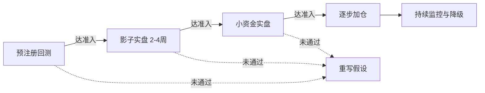

### **V1 最终定稿规格书：状态驱动型趋势策略**

以 ADX 为总开关，纯 TA baseline，只做多，硬过滤，默认参数，固定风险仓位。目标不是收益最大化，而是先验证"从信号到回测到实盘"这条流水线不会骗你。

---

## 一、定位与心态

这套 EMA + MACD + RSI + 布林 + ADX 的组合是经典技术分析的标准件，BTC/ETH 上每天有数以万计的同类策略在跑。**必须承认：它本身不是你的 alpha，它是你的 baseline**。真正的差异化优势（资金费率、未平仓合约等衍生品维度，或多策略组合分散）一律推迟到 V2/V3。

V1 的唯一使命，是建立一个干净、可信、可归因的基准，以及一条不会自欺的研究执行流水线。所以 V1 的成功标准**不是收益率**，而是回答一个问题：我这条从回测到实盘的管线，会不会骗我？

整个项目分三步走，边界事先划死，防止范围蔓延：

| 版本 | 目标 | 核心动作 | 关键约束 |
|------|------|---------|---------|
| V1 | 验证流水线可信、baseline 可行 | 纯 TA、只做多、硬过滤、默认参数 | 不优化、不加维度、不做空 |
| V2 | 在 baseline 上加边际优势 | 接资金费率/OI、对照测 ADX 自适应出场、评估做空 | 每次只改一个大变量 |
| V3 | 走向多策略组合 | 加入弱相关策略、组合级风控升级 | 有第二套能赚钱的策略后再抽象框架 |

---

## 二、V1 策略规格

所有指标采用教科书默认参数，V1 阶段不做任何优化——优化正是自欺开始的地方，默认值至少不是你拟合出来的。

### 指标体系与分工

| 维度 | 指标 | 参数 | 职能 |
|------|------|------|------|
| 状态识别 | ADX | 14 | 总开关，决定是否启用策略 |
| 大方向 | 日线 EMA | 50 | 方向锚 |
| 趋势方向 | EMA 双线 | 50 / 200（H4） | 多空排列确认 |
| 动量触发 | MACD | 12, 26, 9 | 主入场扳机 |
| 位置过滤 | RSI | 14 | 避免追高 |
| 波动率位置 | 布林带 | 20, 2 | 趋势恢复确认 |
| 量能确认 | 成交量均线 | 20 | 资金支撑确认 |
| 止损仓位 | ATR | 14 | 动态止损与仓位 |

### 多周期对齐结构

| 周期 | 角色 | 规则 |
|------|------|------|
| 日线 D1 | 方向锚 | 日线 EMA50 向上时才允许做多，向下时禁止做多 |
| H4 | 信号主周期 | 完整共振条件在此判断（ADX、EMA、MACD、RSI、布林、成交量） |
| H1 | 入场精修 | H4 信号触发后，在 H1 等待回调至 EMA21 附近入场 |

多周期对齐顺带补偿了 ADX 的滞后性：若日线 ADX 已趋势化，H4 的 ADX 门槛可适当放宽至 20；若日线 ADX 也很低，H4 门槛必须严格守住 25。

**H1 入场精修超时机制**——H4 信号触发后，H1 入场等待窗口为 4-6 根 H1 K 线（约 4-6 小时）。若窗口内未回调至 EMA21 附近，则取消该信号，不追高入场。若窗口内价格反而跌破 H4 信号触发时的 K 线低点，则信号失效，直接放弃。这条规则确保入场精修不会变成"无限等待错过行情"或"等太久最后追高"。

### 做多信号（硬过滤，六条全满足才触发；V1 只做多）

1. **状态层**：ADX(14) > 25
2. **方向层**：日线 EMA50 向上 + H4 EMA50 > EMA200
3. **动量层**：MACD 金叉或柱状图由负转正
4. **位置层**：RSI 在 40-60 区间且拐头向上——避开 RSI>70 的追高区，要的是趋势中健康回调后的动量恢复
5. **波动率层**：收盘价站上布林中轨（趋势延续确认）
6. **量能层**：当前成交量 > 20 周期均量

### 出场规则（V1 固定一套，不做 ADX 自适应分档）

V1 不引入 ADX 自适应分档出场，先用一套固定基准，把"两种出场风格"留作 V2 的对照实验。每次只改一个大变量，才能归因。

- **初始止损**：入场价 − 1.5 × ATR(14)
- **第一止盈**：盈利达 1.5 × ATR 时平仓 50%，锁定部分利润
- **剩余仓位**：移动止损跟踪，盈利超 1 × ATR 后止损上移至保本价
- **信号反转强平**：MACD 出现反向交叉，或 RSI > 75，无条件离场
- **时间止损**：开仓后 8-12 根 H4 K 线（约 2-3 天）仍未达 1 × ATR 盈利，无条件平仓
- **休眠继承规则**：持仓期间若 ADX 跌破休眠阈值，立即切换为"时间优先"退出——止损收紧到保本附近，2-3 根 K 线内强制了结。让趋势策略干净了结趋势市留下的头寸，而不是在震荡市里继续用趋势工具管理它

### 仓位计算

采用固定风险百分比，而非固定仓位比例。每笔交易最大亏损锁定为账户权益的 1%：

$$
\text{下单量} = \frac{\text{账户权益} \times 1\%}{|\text{入场价} - \text{止损价}|}
$$

ATR 大时止损距离远、仓位自动变小；ATR 小时仓位适当变大。每笔真实风险恒定，与币种波动率无关。

### 币种池与选币规则

V1 只在 BTC/USDT、ETH/USDT 上跑。同时多币信号扎堆时，**按相关性分散选币**，而不是比谁信号更强——选最不重叠的风险，不选最漂亮的信号。

---

## 三、五层风险控制体系

加密市场的相关性是状态依赖的：系统性下跌时，各币种、各策略的相关性会瞬间冲到接近 1。**你最需要分散保护的时候，恰恰是分散失效的时候**。所以真正救命的是组合级总敞口熔断，而不是分散本身。

| 风控层级 | 关注对象 | 核心规则 |
|---------|---------|---------|
| 单笔层 | 每一笔交易 | 单笔风险不超过权益 1%；ATR 动态止损 |
| 标的层 | 单一币种 | 单一币种最大风险敞口受限，防止过度集中 |
| 策略层 | 单一策略 | 日亏损 5% 当天停手；周亏损 10% 暂停复盘；连续 N 笔亏损自动降仓 |
| 组合层 | 整个账户 | 同时持仓不超过 3 个低相关币种；同方向总风险设硬顶；组合总回撤熔断架在账户层而非策略层 |
| 异常层 | 工程状态 | API 异常、交易所异常、状态不一致时停止开新仓，进入安全模式 |

组合层风控尤其关键：同时持有多个高相关币种的多头，表面上每笔风险只有 1%，但系统性行情里同时触发止损时，账户实际承受的是多笔叠加。V1 即使只跑一套策略，也必须先有组合风控雏形。异常层则把工程问题和风控挂钩——状态不明时不是"工程 bug"，而是"风险暴露"，必须立即停止开新仓。

---

## 四、验证流水线

从回测到实盘的完整迁移路径，每一环都有明确准入门槛。**所有门槛必须在跑回测之前白纸黑字写死，事后不允许挪动。**

### 第一环：预注册式回测

跑回测之前先签一份不可修改的"策略契约"，把币种池、时间范围、参数、成本假设、回测次数预算、圣域数据全部锁定。跑完无论结果好坏，先回答三个归因问题再决定下一步——信号频率是否符合预期？盈亏来源是否和假设一致？亏损是集中还是均匀分布？

### 第二环：影子实盘（2-4 周）

策略在真实行情下虚拟下单，记录订单簿环境下的可成交价、API 响应时间、滑点。产出**执行损耗报告**，比较理论成交与实际可成交的偏差。这一环比小资金实盘更有价值，因为小资金的市场冲击和真实仓位不在一个量级。

影子实盘至少要回答：回测中的信号在实时环境中是否同样触发；信号触发后真实可成交价格和回测假设差多少；滑点是否稳定；H4 收盘后的执行延迟是否可接受；交易所 API 是否稳定；订单簿深度是否支持未来目标仓位；限价单与市价单哪种更适合该策略；信号是否集中在流动性较差的时段。

### 第三环：小资金实盘

用可承受全损的资金（100-500 USDT）验证 API 稳定性、延迟、真实滑点、断网恢复。验证真实下单是否稳定、部分成交如何处理、撤单失败如何处理、网络断开后是否能恢复、交易所持仓和本地状态是否一致、止损止盈是否按预期执行、风控熔断是否真的生效。

### 第四环：逐步加仓

小资金实盘稳定运行指定周期后，按预设节奏逐步加仓。**上线后至少 3 个月内不允许改任何参数。**

---

## 五、策略契约

事后挪门球的最大动力来自亏损情绪和沉没成本，事前定的数字是冷静的你和热血的你之间的契约。这份契约必须事先签字、事后不可修改。

| 项目 | 必须事先写死的内容 |
|------|---------|
| 回测准入 | 有效交易笔数下限、夏普下限、最大回撤上限、覆盖牛/熊/震荡三种市场 |
| 影子准入 | 运行长度、滑点偏离上限、信号一致性下限 |
| 实盘准入 | 起始资金、加仓节奏（多少周后允许翻倍仓位、达到什么条件） |
| 降仓触发 | 滚动 30 天回撤超阈值 → 仓位砍半；连续 N 笔亏损 → 暂停 N 天 |
| 死亡触发 | 累计回撤超死亡线，或滚动 60 天盈亏比低于回测基准 50% → 无条件下线 |
| 修改窗口 | 上线后至少 3 个月禁止改任何参数 |

---

## 六、策略生命周期管理

策略不是一上线就永远跑，也不是一亏损就立刻关。需要一个风险降级过程，避免在最大回撤前夕关掉然后错过反弹。**触发警报时先降仓 + 复盘，而不是直接关停**——直接关策略容易关在反转前夜。

| 状态 | 含义 | 触发条件 | 处理方式 |
|------|------|---------|---------|
| 正常 | 表现接近历史基准 | — | 正常运行 |
| 观察 | 部分指标恶化 | 信号频率偏离均值、盈亏比略降 | 不加仓，增强监控 |
| 降风险 | 回撤或执行质量明显恶化 | 滚动 30 天回撤超阈值、连续 N 笔亏损 | 仓位砍半，减少交易 |
| 暂停 | 触发失效或极端风险 | 累计回撤超死亡线、滚动 60 天盈亏比低于基准 50% | 停止新开仓，只管理已有仓位，人工复盘 |

---

## 七、归因日志

V1 的代码可以简单，但归因日志的字段必须从第一笔交易就完整记录。事实层日志（信号、价格、滑点）只是底线，真正决定 3-6 个月后能否复盘的是**归因层日志**。

**开仓时记录**：日线 ADX、H4 ADX、EMA 距离、波动率分位数、当周 BTC 走势分类（单边涨/震荡/跌）、距上次信号间隔、账户近 10 笔胜负序列。

**平仓时记录**：退出原因分类（止盈/移动止损/信号反转/时间止损/强平/风控熔断）、实际滑点、API 延迟。

3-6 个月后复盘时，核心问题不是"策略赚了还是亏了"——看曲线就知道——而是"**盈亏来自什么样的市场环境，是不是和设计假设一致**"。如果 80% 利润来自一段牛市里的两笔交易，那策略其实没被验证，你只是赌对了一段 β。没有归因日志，曲线会骗你；有归因日志，才能区分 alpha 和运气。

---

## 八、工程底线

个人量化第一年的真实死因往往不是策略亏，是工程漏。策略逻辑再完美，工程层面出问题一样会亏钱。

### 三条处理原则

1. **状态以交易所为准，本地为缓存**。系统启动时第一件事是从交易所拉取真实持仓和挂单，与本地状态对账，不一致时本地服从远端。
2. **幂等下单**。每笔订单带客户端 ID，失败重试时不能造成重复开仓。
3. **异常即停**。任何对账不一致、API 持续报错、推送长时间无响应——直接进入"只平仓不开仓"的安全模式，等人工介入。**自动交易系统宁可错过机会，不可在状态不明时硬干。**

### 八种异常场景测试清单

以下场景必须在开发阶段逐条测试并确认处理逻辑：

- 本地记录已平仓，但交易所仍有持仓
- 本地记录有持仓，但交易所没有持仓
- 移动止损本地更新失败
- 订单部分成交
- 下单失败但状态被标记为已开仓
- API 延迟或限流
- 网络中断后程序重启状态丢失
- 交易所临时维护或无法撤单

---

## 九、明确划在 V1 之外的事

为防边界蔓延，以下全部推迟到 V2 及以后：

- **做空模块**（V2 评估，采用更严阈值和更小仓位，不简单镜像做多）
- **评分制**（需要实盘样本才能校准权重，否则等于在拟合想象中的市场）
- **ADX 自适应分档出场**（作为 V2 的对照实验）
- **另类数据**（资金费率、OI、链上数据，V2 优先接入资金费率和 OI）
- **多策略框架**（V3 再抽象，过早工程化是个人量化最经典的拖延陷阱）
- **中小市值币种**（V2 单独回测，不假设参数通用）

---

## 十、迭代路线

| 版本 | 目标 | 核心变更 |
|------|------|---------|
| V1 | 验证流水线可信 | 纯 TA baseline、默认参数、只做多、硬过滤、固定出场 |
| V2 | 引入真正 alpha | 接入衍生品数据（资金费率、OI）作为正交指标；出场风格对照实验；评估做空模块 |
| V3 | 提升信号弹性 | 硬过滤升级为分层评分制；加入做空子策略（独立评估） |
| V4 | 策略组合分散 | 同时跑 3-5 套弱相关策略，组合层风控统一管理 |

V2 接入另类数据时，才能清楚看到这些数据带来多少边际改善——因为 V1 提供了干净的对照基准。V3 的评分制也必须等 V1 积累足够实盘样本后才能设计权重，否则等于在拟合想象中的市场。

---

## 下一步

方案到此已经收敛完毕，不再需要新一轮发散讨论。**真正的下一步不在聊天窗口里，在回测引擎里**。把以上入场条件、出场规则、成本假设、币种池、时间范围、成功失败合同、归因日志字段全部翻译成具体数值和代码，跑第一条回测曲线。无论结果好看还是难看，那条曲线带回来的信息量，会比再多十轮讨论都大——因为它是第一份来自真实历史数据的反馈。

带着那条曲线回来，下一轮的话题就会从"该不该用某条规则"变成"回测里某个区间胜率明显偏低，该怎么调"这类有数据支撑的具体问题。

---

以上均为策略与系统工程层面的设计思路探讨，加密市场波动和风险极大，任何策略上线前都需要用可承受全损的小资金充分验证，不构成任何投资建议。

*内容由 AI 生成仅供参考*