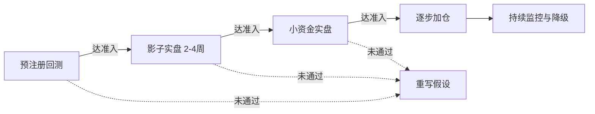

### **多指标复合趋势策略 V1 最终方案（合并版）**

本文档由前面五份总结合并而成：以 Opus 4.8 的规格书结构为骨架，吸收 GPT 5.5 对每条规则的设计理由作为附录 A，吸收 Deepseek 的阶段切换检查清单作为附录 B。主文档让你立刻能动手，附录 A 让三个月后的你能复盘当初判断，附录 B 让你在每次阶段切换时不漏关键步骤。

---

# **主文档**

## **一、定位与心态**

V1 不是要找最赚钱的策略，而是建立一个**有明确边界、可归因、可降级、可迭代的最小可验证系统**，并验证"研究→回测→影子实盘→小资金"这条流水线本身是否可信。

EMA + MACD + RSI + 布林 + ADX 是经典 TA 标准件，BTC/ETH 上每天有数以万计的同类策略在跑。**它本身不是 alpha，是 baseline**。真正的差异化优势留到后续版本通过另类数据或策略组合分散去构建。

整个项目分四个版本推进，每版只解决一个主题：

| 版本 | 主题 | 核心动作 |
|------|------|---------|
| V1 | 验证流水线可信、baseline 可行 | 纯 TA、只做多、硬过滤、默认参数 |
| V2 | 解决横盘期亏损 | 加入市场状态分流（趋势/震荡/模糊），震荡市启用独立均值回归子策略 |
| V3 | 引入真正 alpha | 接入资金费率/OI 等衍生品维度；硬过滤升级为分层评分；评估做空模块 |
| V4 | 降低单策略失效风险 | 多套弱相关策略并行，组合层风控统一管理 |

## **二、V1 策略规格**

所有指标采用教科书默认参数。V1 阶段不做任何参数优化——优化是自欺的入口。

### **指标体系**

| 维度 | 指标 | 参数 | 职能 |
|------|------|------|------|
| 状态识别 | ADX | 14 | 总开关，决定是否启用策略 |
| 大方向 | 日线 EMA | 50 | 方向锚 |
| 趋势方向 | EMA 双线 | 50 / 200（H4） | 多空排列确认 |
| 动量触发 | MACD | 12, 26, 9 | 主入场扳机 |
| 位置过滤 | RSI | 14 | 避免追高 |
| 波动率位置 | 布林带 | 20, 2 | 趋势恢复确认 |
| 量能确认 | 成交量均线 | 20 | 资金支撑确认 |
| 止损仓位 | ATR | 14 | 动态止损与仓位 |

### **多周期对齐**

- **日线 D1**：方向锚。日线 EMA50 向上才允许做多，向下禁止
- **H4**：信号主周期，所有共振条件在此判断
- **H1**：入场精修，H4 信号触发后在 H1 等待回调至 EMA21 附近入场

多周期对齐顺带补偿了 ADX 的滞后：日线已趋势化时（日线 ADX > 25），H4 的 ADX 门槛可放宽到 20；日线 ADX 低时，H4 必须严守 25。

### **做多信号（硬过滤，六条全满足才触发；V1 只做多）**

1. **状态层**：H4 ADX(14) > 25
2. **方向层**：日线 EMA50 向上 + H4 EMA50 > EMA200
3. **动量层**：MACD 金叉或柱状图由负转正
4. **位置层**：RSI 在 40–60 区间且拐头向上
5. **波动率层**：收盘价站上布林中轨
6. **量能层**：当前成交量 > 20 周期均量

### **出场规则（V1 固定一套，不做 ADX 自适应分档）**

- 初始止损：入场价 − 1.5 × ATR
- 第一止盈：盈利达 1.5 × ATR 时平 50%
- 剩余仓位：盈利超 1 × ATR 后止损上移至保本，之后按移动止损跟踪
- 信号反转强平：MACD 反向交叉，或 RSI > 75
- 时间止损：开仓后 8–12 根 H4 K 线仍未达 1 × ATR 盈利，无条件平仓
- **休眠继承规则**：持仓期间若 ADX 跌破 20，立即切到"时间优先"退出——止损收紧到保本附近，2–3 根 K 线内强制了结。趋势策略干净了结趋势市留下的头寸，不在震荡市里继续用趋势工具

### **仓位计算（固定风险百分比）**

每笔最大亏损恒为权益的 1%，与币种波动率无关：

$$	ext{单笔下单量} = \frac{	ext{账户权益} 	imes 1\%}{\,|\,	ext{入场价} - 	ext{止损价}\,|\,}$$

### **币种池与选币**

V1 只在 BTC/USDT、ETH/USDT 上跑。多币信号同时触发时按相关性分散选币——选最不重叠的风险，不选最漂亮的信号。

## **三、三层风险控制**

加密市场的相关性是状态依赖的：系统性下跌时各币种、各策略相关性瞬间冲到接近 1，**最需要分散保护的时候恰恰是分散失效的时候**。真正救命的是组合级总敞口熔断。

| 层级 | 锁定规则 |
|------|---------|
| 单笔 | 风险 ≤ 权益 1%，ATR 动态止损 |
| 策略 | 日亏 5% 停手当天，周亏 10% 暂停复盘，连续 5 笔亏损自动降仓 |
| 组合 | 同时持仓 ≤ 3 个低相关币种，同方向总风险 ≤ 权益 3%，账户层回撤熔断（非策略层） |

## **四、样本量下限（独立成节，不可与夏普并列处理）**

这是 Deepseek 反复强调但容易被忽视的一条铁律：**夏普 2.0 的 30 笔样本，和夏普 1.0 的 200 笔样本，后者才是真信号**。

V1 在硬过滤 + 只做多 + H4 + 日线方向锚下，BTC + ETH × 2-3 年大概率只能凑出几十笔有效交易。统计上几乎无法区分"有 edge"和"运气好"。

**铁律**：如果回测有效交易笔数 < 50–60 笔，不论曲线多漂亮，都**不准入影子实盘**。先扩大币种池（增加 SOL、BNB 等高流动性主流币）或延长历史区间凑样本，再决定下一步。这条优先级**高于**夏普下限。

## **五、验证流水线**

**预注册回测**：跑之前先签策略契约（见第六节），锁定币种池、时间范围、参数、成本假设、回测次数预算（≤ 20 次）、圣域数据（留 30% 到最后才看）。跑完无论结果好坏，先回答三个归因问题再决定下一步——信号频率是否符合预期、盈亏来源是否和假设一致、亏损是集中还是均匀。

**影子实盘**：策略在真实行情下虚拟下单，记录订单簿环境下的可成交价、延迟、滑点，产出执行损耗报告。这一环比小资金实盘更有价值，因为小资金的市场冲击和真实仓位不在一个量级。运行 2–4 周。

**小资金实盘**：用可承受全损的 100–500 USDT，验证 API 稳定性、断网恢复、真实滑点。

**逐步加仓**：上线后**至少 3 个月禁止改任何参数**。

## **六、策略契约（事前签字、事后不可修改）**

事后挪门球的最大动力来自亏损情绪和沉没成本。事前定的数字是冷静的你和热血的你之间的契约。下表给出**建议初值**，可根据风险偏好微调，但不能留空。

| 项目 | 建议初值 |
|------|---------|
| 回测有效交易笔数下限 | ≥ 60 笔（不达标先扩样本，不论夏普如何） |
| 回测夏普下限 | ≥ 1.0（计入手续费 + 滑点 + 资金费率后） |
| 回测最大回撤上限 | ≤ 25% |
| 回测必须覆盖 | 牛市 + 熊市 + 震荡市三种环境 |
| 影子实盘运行长度 | ≥ 3 周 |
| 影子实盘滑点偏离上限 | 实际滑点 ≤ 回测假设的 1.5 倍 |
| 影子实盘信号一致性 | ≥ 95% 信号在实盘环境同步触发 |
| 小资金实盘起始 | 100–500 USDT |
| 小资金阶段持续 | ≥ 3 个月才考虑加仓 |
| 降仓触发 | 滚动 30 天回撤 > 15% → 仓位砍半；连续 5 笔亏损 → 暂停 7 天 |
| 死亡触发 | 累计回撤 > 30%，或滚动 60 天盈亏比低于回测基准 50% → 无条件下线 |
| 修改窗口 | 上线后 ≥ 3 个月禁止改参数 |
| 回测次数预算 | ≤ 20 次 |
| 圣域数据 | 保留最后 30% 历史数据，决策前不准看 |

签字日期写上，文件锁定不修改。

## **七、生命周期管理（四档状态机）**

直接关策略容易关在反转前夜。触发警报时**先降仓 + 复盘，不直接关停**。

| 状态 | 触发 | 处理 |
|------|------|------|
| 正常 | — | 标准运行 |
| 观察 | 信号频率偏离均值 ±30%、盈亏比略降 | 不加仓，增强监控 |
| 降风险 | 滚动 30 天回撤 > 15%、连续 5 笔亏损 | 仓位砍半 |
| 暂停 | 触发死亡线 | 停开新仓，只管存量，人工复盘 |

## **八、归因日志（V1 第一笔交易就必须完整记录）**

事实层日志（信号、价格、滑点）只是底线。真正决定 3–6 个月后能否复盘的是**归因层日志**：

**开仓时快照**：日线 ADX、H4 ADX、EMA 距离、波动率分位数、当周 BTC 整体走势分类（单边涨/震荡/跌）、距上次信号时长、近 10 笔胜负序列。

**平仓时分类**：退出原因（止盈/移动止损/信号反转/时间止损/强平/风控熔断）、实际滑点、API 延迟。

归因日志能告诉你利润究竟是 alpha 还是 β——如果 80% 利润来自一段牛市的两笔交易，策略其实没被验证，你只是赌对了一段行情。**没有归因日志，曲线会骗你**。

## **九、工程层底线**

个人量化第一年的真实死因往往不是策略亏，是工程漏。V1 至少做到三件：

1. **状态以交易所为准、本地为缓存**：启动时先与交易所对账，不一致时本地服从远端
2. **幂等下单**：每笔订单带客户端 ID，失败重试不造成重复开仓
3. **异常即停**：对账失败、API 持续报错、推送长时间无响应 → 自动进入"只平仓不开仓"安全模式

**自动交易系统宁可错过机会，不可在状态不明时硬干**。

## **十、明确划在 V1 之外的事**

为防止边界蔓延，以下全部推迟：

- 做空模块（V3 评估，做空采用更严阈值、更小仓位，不简单镜像做多）
- 评分制（V3 引入，需实盘样本校准权重）
- ADX 自适应分档出场（V2 作对照实验）
- 另类数据：资金费率、OI、链上数据（V3 优先接资金费率和 OI）
- 均值回归子策略（V2 引入，仅在 ADX < 20 的震荡市启用）
- 多策略框架（V4 再抽象，过早工程化是个人量化最经典的拖延陷阱）
- 中小市值币种（V2 单独回测，不假设参数通用）

---

# **附录 A：每条规则的设计理由**

三个月后你回头复盘时，会忘记当初为什么这么定。这一节专门为未来的你准备。

### **为什么 RSI 用 40–60 区间且拐头向上，而不是 < 30**

RSI < 30 意味着"极度超卖"，但在强下跌行情里 RSI 可以长期低位钝化——你不是在抄底，是在接刀子。趋势跟随做多想要的不是极端超卖，而是**趋势中的健康回调点**：大趋势仍向上、价格经历回调、RSI 回落到中性偏弱区域、然后重新向上。40–60 区间 + 拐头向上正好刻画这个状态，避开了"追高"和"接刀"两个极端。

### **为什么布林带用作"位置 + 趋势恢复确认"，而不是"波动率过滤"**

布林带在策略里有三种可能用法：位置过滤、趋势恢复确认、波动率过滤。三种用法混在一起会让逻辑模糊。V1 把波动率控制完全交给 ATR（动态止损 + 仓位计算），布林带专心做"价格是否重新站上中轨"这一个判断——逻辑单一、归因清晰。

### **为什么 V1 只做多、不做空**

加密市场的下跌和上涨是两种不同的物理过程：上涨渐进、有回调、持续数天到数周；下跌急、短、V 型反抽剧烈。做空还要承受资金费率持续侵蚀。V1 同时做多做空会让亏损来源无法归因——你不知道是策略不行，还是做空逻辑不行。先把做多跑通，做空作为独立子策略 V3 再评估。

### **为什么硬过滤而不是评分制**

评分制看似灵活，但权重和阈值本身就是新的过拟合参数——把"6 个布尔条件"换成"6 个权重 + 1 个阈值"，参数空间反而更大。没有实盘样本支撑就设计权重，等于在拟合想象中的市场。V1 用硬过滤建立干净基准，V3 等积累了实盘样本再过渡到评分制。

### **为什么时间止损 8–12 根 H4 K 线**

趋势策略的入场假设是"趋势即将延续"。开仓后 2–3 天（约 8–12 根 H4）价格仍不动，假设可能不成立。继续占用资金和风险预算没有意义。8–12 根是经验区间，V1 取 10 根作为默认起点，V2 可作为对照参数测试。

### **为什么仓位用固定风险百分比，而不是固定仓位比例**

固定仓位比例下，止损距离 1% 时和 5% 时的实际亏损差 5 倍——风险不可控。固定风险百分比反过来：先定每笔最大亏 1%，再用入场价和止损价的距离反推下单量。ATR 大时仓位自动变小，ATR 小时仓位自动变大，每笔真实风险恒定。这对自动交易系统尤其重要——系统不会像人那样"感觉今天波动大少买点"，规则必须前置写死。

### **为什么 ADX > 25 是总开关**

ADX 描述趋势强度。加密市场大量时间不是趋势，而是高波动横盘——这种环境下趋势策略会被反复扫止损。ADX > 25 把策略从"在所有市场都交易"收缩到"只在趋势市交易"，是从指标组合升级为交易系统的关键一步。但 ADX 是滞后指标且只描述趋势强度不描述质量——所以它只决定开/关，不决定方向，方向由 EMA 决定。

### **为什么休眠继承规则单独写**

如果 ADX 在你持仓中跌破阈值，你处境很微妙：仓位是用趋势逻辑开的，但市场已经不是趋势市。继续用移动止损和分批止盈管理它，相当于在震荡市里用趋势工具——会被反复扫损。立刻清仓又破坏了原本的出场计划。"时间优先"退出（紧止损 + 短时窗）让趋势策略干净了结趋势市留下的头寸，不在震荡市继续交易，逻辑自洽。

### **为什么单笔风险 1%、组合同方向 ≤ 3%、账户回撤 30% 下线**

1% 单笔风险意味着连续 30 笔全亏才会到 30% 回撤——这给了策略充分的时间证明自己。同方向 3% 上限防止系统性行情中多笔同时止损叠加。30% 回撤下线是经验阈值——超过这里继续运行的恢复期太长（30% 回撤需要 43% 反弹才回本），且大概率说明 alpha 已失效。

---

# **附录 B：阶段切换检查清单**

每次进入下一阶段前，逐项打钩。任何一项未达成，**不进**。

### **B.1 跑回测前**

- [ ] 策略契约已签字、写日期、文件锁定
- [ ] 圣域数据（最后 30%）已物理切出，决策前不打开
- [ ] 回测次数预算已定（≤ 20 次），已建立计数表
- [ ] 币种池、时间范围、参数全部固定，写入配置文件
- [ ] 成本假设已明确（手续费 0.07% + 滑点模型 + 资金费率）
- [ ] 归因日志字段已设计完整，回测引擎能输出
- [ ] 失败重写流程已定（哪些情况下重新设计假设、哪些情况下放弃）

### **B.2 进影子实盘前**

- [ ] 回测有效交易笔数 ≥ 60 笔
- [ ] 回测夏普 ≥ 1.0（含成本）
- [ ] 最大回撤 ≤ 25%
- [ ] 数据覆盖牛/熊/震荡三种环境
- [ ] 圣域数据上的表现已检查，与训练区间偏差在容忍内
- [ ] 三个归因问题已回答：信号频率符合预期？盈亏来源和假设一致？亏损是集中还是均匀？
- [ ] 工程三底线已实现：状态对账、幂等下单、异常即停
- [ ] 归因日志在影子实盘环境已能完整记录

### **B.3 进小资金实盘前**

- [ ] 影子实盘运行 ≥ 3 周
- [ ] 实际滑点 ≤ 回测假设的 1.5 倍
- [ ] 信号一致性 ≥ 95%
- [ ] 至少经历过一次程序重启 + 状态对账，结果正确
- [ ] 至少经历过一次 API 异常，安全模式触发正确
- [ ] 执行损耗报告已产出，损耗在可承受范围
- [ ] 资金已准备（100–500 USDT，可承受全损）

### **B.4 加仓前**

- [ ] 小资金实盘运行 ≥ 3 个月
- [ ] 期间未触发任何死亡线
- [ ] 期间未修改任何参数
- [ ] 归因日志显示盈亏来源与设计假设一致（不是单一行情碰运气）
- [ ] 状态机从未进入"暂停"档
- [ ] 加仓节奏已预先写死（每次加多少、间隔多久、达到什么条件）

### **B.5 任意时刻触发以下情况，立刻执行**

- [ ] 滚动 30 天回撤 > 15% → 仓位砍半（自动）
- [ ] 连续 5 笔亏损 → 暂停 7 天（自动）
- [ ] 累计回撤 > 30% → 无条件下线（自动）
- [ ] 滚动 60 天盈亏比 < 回测基准 50% → 无条件下线（自动）
- [ ] 对账失败 / API 持续报错 → 切换到只平仓不开仓（自动）
- [ ] 任何手动干预决定 → 必须先在归因日志中写明理由再操作

---

## **结语**

方案到此完成。下一步不在对话框里，在回测引擎里。把上面每一个数值、每一条规则、每一个检查项翻译成代码与配置，跑出第一条回测曲线。那条曲线带回的信息量会比任何文字讨论都大——因为它来自真实历史数据。

带着第一条回测曲线回来，下一轮的话题会从"该不该用某条规则"变成"回测里某个区间胜率明显偏低，该怎么调"这类有数据支撑的具体问题。

加密市场波动和风险都极大，以上仅为策略与系统工程层面的设计思路探讨，**不构成任何投资建议**，实盘前请务必用可承受全损的小资金充分验证。

*内容由 AI 生成仅供参考*