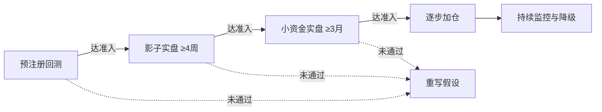

下面这份是把五版总结合并、去重，并补齐它们共同留白的**定稿规格书**。合并逻辑是：以 Opus 4.8 的"可写代码的规格书"为骨架，吸收 GPT 5.5 更细的风控分层与第五档生命周期状态，采纳 Deepseek/GLM 补全到 V4 的迭代路线，并把上一轮我指出的六个留白——契约空数字、样本量矛盾、现货/合约未定、模糊条件、区间值、数据协议打架——**就地填死成确定值**。所有新填的数字都是按"首版从严"的保守初值给的，可在签约时按你的风险偏好微调，但**一旦签字即锁定**。

---

### **多指标复合趋势策略 · V1 定稿规格书**

#### **〇、本合并版相对五版的三处实质改动**

第一，把"策略契约"从空表填成了带具体数值的可签字版本——这是五版反复强调却全部留空的核心。第二，显式拍板了两个被回避的决策：**V1 用现货（非永续合约）**，以及**样本量与币池的矛盾如何处理**。第三，把入场里所有"拐头""站上""附近"等人话，逐条翻译成可直接编码的布尔判定，让"预注册回测"名副其实。

#### **一、定位与版本路线**

这套 EMA + MACD + RSI + 布林 + ADX 是经典技术分析标准件，BTC/ETH 上每天有海量同类策略在跑。**必须先认清：它本身不是 alpha，是 baseline。** V1 的成功标准不是收益率，而是回答一个问题——我这条从回测到实盘的流水线，会不会骗我。真正的边际优势留到后续版本。

| 版本 | 目标 | 核心动作 | 关键约束 |
|------|------|---------|---------|
| V1 | 验证流水线可信、baseline 可行 | 现货、只做多、硬过滤、默认参数 | 不优化、不加维度、不做空 |
| V2 | 加边际优势 | 接资金费率/OI、对照测 ADX 自适应出场、评估做空 | 每次只改一个大变量 |
| V3 | 提升信号弹性 | 硬过滤升级为硬地板+评分制；做空作独立子策略 | 需 V1/V2 实盘样本校准 |
| V4 | 策略组合分散 | 趋势/均值回归/突破等弱相关策略并行，组合级风控统一 | 有第二套能赚钱的策略后再抽象框架 |

#### **二、V1 策略规格（全部教科书默认参数，不优化任何阈值）**

| 维度 | 指标 | 参数 | 职能 |
|------|------|------|------|
| 状态识别 | ADX | 14 | 总开关，决定是否启用策略 |
| 大方向 | 日线 EMA | 50 | 方向锚 |
| 趋势方向 | EMA 双线 | 50 / 200（H4） | 多空排列确认 |
| 动量触发 | MACD | 12, 26, 9 | 主入场扳机 |
| 位置过滤 | RSI | 14 | 避免追高 |
| 波动率位置 | 布林带 | 20, 2 | 趋势恢复确认 |
| 量能确认 | 成交量均线 | 20 | 资金支撑确认 |
| 止损仓位 | ATR | 14 | 动态止损与仓位 |

**多周期分工**：日线 EMA50 向上才允许做多、向下禁止（方向锚）；H4 是信号主周期；H1 做入场精修。日线已趋势化（日线 ADX > 25）时，H4 的 ADX 门槛可放宽到 20，否则严格守 25——这是对 ADX 滞后的补偿。

**做多信号（硬过滤，六条全满足才触发；V1 只做多）。** 每条都给出精确布尔定义，消灭临场解释空间：

| 层 | 人话条件 | 精确布尔判定（t = 当前已收盘 H4 K 线） |
|----|---------|----------------------------------------|
| 状态 | ADX 趋势化 | `ADX[t] > 25`（日线 ADX[t] > 25 时放宽为 `> 20`） |
| 方向 | 日线向上 + H4 多头 | `EMA50_D1[t] > EMA50_D1[t-1]` 且 `EMA50_H4[t] > EMA200_H4[t]` |
| 动量 | MACD 转强 | `DIF[t] > DEA[t]` 且 `DIF[t-1] ≤ DEA[t-1]`（金叉），或 `Hist[t] > 0` 且 `Hist[t-1] ≤ 0`（柱由负转正）——二选一，签约时定死用哪个 |
| 位置 | RSI 健康回调后回升 | `40 ≤ RSI[t] ≤ 60` 且 `RSI[t] > RSI[t-1]` 且 `RSI[t-1] ≤ RSI[t-2]`（拐点） |
| 波动率 | 站上布林中轨 | `Close[t] > BBmid[t]` 且 `Close[t-1] ≤ BBmid[t-1]`（刚站上，确认"恢复"） |
| 量能 | 放量 | `Volume[t] > SMA(Volume,20)[t]` |

**入场精修（H1）**：H4 信号成立后，在 H1 上等待 `Low[h] ≤ EMA21_H1[h] × 1.005` 且 `Close[h] > EMA21_H1[h]`（回调触及 EMA21 的 0.5% 带内并收回上方）时入场；若 H4 信号成立后 6 根 H1 内未出现该回调，则按 H4 收盘价直接市价入场，不再等待。

**出场规则（V1 固定一套，不做 ADX 自适应分档）**：

- 初始止损：入场价 − 1.5 × ATR(14)
- 第一止盈：盈利达 1.5 × ATR 平 50%
- 剩余仓位：盈利超 1 × ATR 后止损上移至保本价，之后按 1.5 × ATR 移动止损跟踪
- 信号反转强平：`DIF` 下穿 `DEA`（MACD 反向），或 `RSI > 75`
- 时间止损：**固定 10 根 H4 K 线**（不再用 8–12 区间），仍未达 1 × ATR 盈利则无条件平仓
- 休眠继承规则：持仓期间若 ADX 跌破 20，立即切到"时间优先"退出——止损收紧到保本附近，2 根 K 线内强制了结，干净了结趋势头寸，不在震荡市里硬用趋势工具管理

**仓位计算**（固定风险百分比，非固定仓位）。V1 首版锁 **0.5%**（理由：策略尚未验证，用最小可承受风险起步；升到 1% 是验证通过后的决策，不在 V1 内）：

$$	ext{单笔下单量} = \frac{	ext{账户权益} 	imes 0.5\%}{\,|\,	ext{入场价} - 	ext{止损价}\,|\,}$$

**交易品种：V1 用现货，不用永续合约。** 现货无资金费率、无强平、无杠杆，成本结构最干净，与"只做多 baseline"定位完全契合。永续合约、资金费率成本、做空一并推迟到 V2。这一项钉死后，成本假设里就不再有"资金费率（如适用）"的含糊。

#### **三、币池与样本量矛盾的显式拍板**

这是五版集体回避的硬矛盾：硬过滤 + 日线锚 + 只做多 + ADX>25 叠在 BTC/ETH 两个币上，2–3 年可能只有几十笔交易，统计上分不清"真有 edge"还是"运气好"。**不能装看不见，必须二选一并写进契约：**

推荐路径——**双轨并行**。主验证线只用 BTC/ETH 现货，作为 baseline 逻辑是否自洽的干净判断；同时另设一条样本线，签约时把币池固定为一个高流动性篮子（BTC、ETH、BNB、SOL、XRP，选定后不再增删），把交易合并计样本量。但必须在契约里白纸黑字写明一句话：**这些币高度相关，系统性行情里同涨同跌，名义 100 笔的等效独立样本远低于 100**，因此判定门槛要相应放保守。若你不接受扩篮子，则替代路径是承认"这是一套低频策略、统计上需要数年才能被证明"，并把仓位压到 0.5% 以下长期观察。

#### **四、分层风险控制（采用更细的六层）**

加密市场的相关性是状态依赖的——系统性下跌时各币种相关性瞬间冲到接近 1，**你最需要分散保护的时候恰恰是分散失效的时候**。所以真正救命的是组合级总敞口熔断，不是分散本身。

| 层级 | 规则 | 锁定数值 |
|------|------|---------|
| 单笔层 | 单笔风险上限 + ATR 动态止损 | ≤ 权益 0.5% |
| 标的层 | 单一币种最大敞口，防过度集中 | 单币占同方向总风险 ≤ 40% |
| 组合层 | 同方向总风险硬顶 + 持仓数上限 | 同时持仓 ≤ 3 个低相关币种；多头总风险 ≤ 权益 1.5% |
| 策略层 | 日/周亏损熔断 + 连续亏损降仓 | 日亏 5% 停手当天；周亏 10% 暂停复盘；连续 6 笔亏损仓位砍半 |
| 账户层 | 组合总回撤熔断（架在账户层，非策略层） | 滚动 30 天回撤 −12% 降仓；累计回撤 −25% 死亡线 |
| 异常层 | 工程故障即停 | 对账不一致 / API 持续报错 / 推送超时 → 只平仓不开仓 |

#### **五、验证流水线与统一数据协议**

**统一数据切分协议（解决 Walk-Forward 与圣域数据打架的问题）**：因为 V1 不优化任何参数、不存在参数拟合，所以传统 Walk-Forward 的"优化段/验证段"在 V1 不适用。V1 的协议是——前 70% 数据跑探索性回测（只看信号频率、归因、盈亏分布，不调参），最后 30% 切为**圣域数据**，全程不许碰，只在最终 go/no-go 决策时跑唯一一次。一旦偷看圣域并据此改了任何规则，圣域作废、整条结论重来。Walk-Forward 推迟到 V2 开始优化时才启用。

**影子实盘**：真实行情下虚拟下单，记录订单簿可成交价、延迟、滑点，产出执行损耗报告。**小资金实盘**用 100 到 500 USDT，验证 API 稳定性、断网恢复、真实滑点。**加仓铁律**：上线后至少 3 个月内不许改任何参数。

#### **六、策略契约（事先签字、事后不可修改——填入具体初值）**

事后挪门球的最大动力来自亏损情绪和沉没成本，事前定的数字是冷静的你和热血的你之间的契约。以下为保守初值，签约时可微调，签字后锁定：

| 项目 | 锁定数值（建议初值） |
|------|---------------------|
| 最小有效样本 | 合并币池 ≥ 100 笔；不足则延长周期或按双轨方案处理 |
| 回测时间范围 | ≥ 3 年，必须覆盖牛 / 熊 / 震荡三种市场 |
| 夏普下限（扣全部成本后） | ≥ 1.0 |
| 最大回撤上限（回测） | ≤ 30% |
| 成本假设 | 手续费 0.07% + 滑点（按品种历史中位数模拟）；现货无资金费率 |
| 回测次数预算 | ≤ 20 次，每次跑前先书面写清假设 |
| 影子实盘准入 | 运行 ≥ 4 周；实盘滑点中位数 ≤ 回测假设的 2 倍；信号一致性 ≥ 90% |
| 降仓触发 | 滚动 30 天回撤 −12% → 仓位砍半；连续 6 笔亏损 → 暂停 5 个交易日 |
| 死亡触发 | 累计回撤 −25%，或滚动 60 天盈亏比 < 回测基准 × 50% → 无条件下线 |
| 修改窗口 | 上线后 ≥ 3 个月禁止改任何参数 |

#### **七、生命周期管理（五档状态机，含"下线复盘"）**

触发警报时先降仓 + 复盘，而非直接关停——直接关策略容易关在反转前夜。"暂停"是临时保护，"下线"是假设被证伪后的终结，二者必须分开：

| 状态 | 触发 | 处理 |
|------|------|------|
| 正常 | 表现接近回测基准 | 标准运行 |
| 观察 | 信号频率偏离、盈亏比略降、滑点轻微恶化 | 不加仓，增强监控 |
| 降风险 | 滚动 30 天回撤 −12%、连续 6 笔亏损 | 仓位砍半 |
| 暂停 | 触发死亡线、或重大异常 | 停开新仓，只管存量，人工复盘 |
| 下线复盘 | 策略假设被证伪（盈亏来源与设计意图系统性背离） | 停止运行，回到 V1 重写假设 |

#### **八、归因日志（第一笔交易就必须完整记录）**

事实层日志（信号、价格、滑点）只是底线，真正决定 3–6 个月后能否复盘的是**归因层日志**。开仓时快照：日线 ADX、H4 ADX、EMA50/200 距离、波动率分位数、当周 BTC 整体走势分类（单边涨/震荡/跌）、距上次信号时长、账户近 10 笔胜负序列。平仓时分类退出原因：止盈 / 移动止损 / 信号反转 / 时间止损 / 休眠继承 / 强平 / 风控熔断，并附实际滑点与 API 延迟。它能告诉你利润是 alpha 还是 β——若 80% 利润来自一段牛市里的两笔交易，那策略其实没被验证，你只是赌对了一段行情。没有归因日志，曲线会骗你。

#### **九、工程层底线（被严重低估的真实死因）**

个人量化第一年的真实死因往往不是策略亏，是工程漏。V1 至少做到三件：**状态以交易所为准、本地为缓存**，启动时先对账、不一致时本地服从远端；**幂等下单**，每笔订单带客户端 ID，失败重试不造成重复开仓；**异常即停**，对账失败或 API 持续报错时自动进入"只平仓不开仓"安全模式。一句话——宁可错过机会，不可在状态不明时硬干。

#### **十、明确划在 V1 之外的事**

为防边界蔓延，以下全部推迟：做空模块（V2 评估，用更严阈值、更小仓位、不简单镜像做多）、永续合约与杠杆（V2）、评分制（V3，需实盘样本校准权重）、ADX 自适应分档出场（V2 对照实验）、另类数据（V2 优先接资金费率和 OI）、市场状态分流/均值回归子策略（V3-V4）、多策略框架（V4 再抽象，过早工程化是个人量化最经典的拖延陷阱）、中小市值币种（V2 单独回测，不假设参数通用）。

---

方案到此**收敛完毕，不再需要新一轮发散**。和五版原稿相比，这份合并版的唯一区别就是：它把所有"留到以后填"的数字和模糊词都钉死了，因此现在它真的能直接翻译成代码。真正的下一步不在对话框里，在回测引擎里——跑出第一条曲线，那条来自真实历史数据的反馈，信息量会比再多十轮讨论都大。

需要的话，我可以接着把这份规格落成某个具体平台（Backtrader / CCXT / FMZ）的回测骨架代码，或者把归因日志的字段设计成一份可直接建表的数据结构。

最后照例提醒：以上仅为策略与系统工程层面的设计思路探讨，加密市场波动和风险都极大，**不构成任何投资建议**，实盘前请务必用可承受全损的小资金充分验证。

*内容由 AI 生成仅供参考*